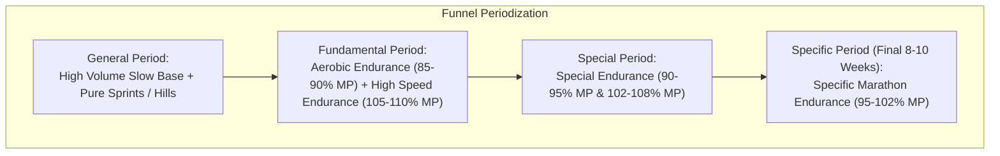

# Renato Canova Marathon & Half-Marathon Methodology

Renato Canova is widely regarded as the most influential modern coach of world-class marathoners (coaching multiple Olympic & World Championship medalists and world record holders). His training architecture is built on the concept of **Specific Endurance** and **Funnel Periodization**.

---

## 1. Funnel Periodization Framework

Traditional periodization moves from low speed/high volume to high speed/low volume. Canova uses a **Funnel** approach:
- Training starts with two opposite extremes: **General Endurance** (slow continuous volume) and **General Speed** (short hills, sprints).
- As the race approaches, training funnels from both sides toward the single most critical quality: **Specific Endurance** (running at 95% to 102% of Marathon/HM Pace for maximum extended volume).

---

## 2. Canova's Pacing Classification

Canova classifies training relative to **Marathon Pace (MP)** or **Half Marathon Pace (HMP)**:

| Category | % of Race Pace | Purpose | Typical Workout Formats |
| :--- | :--- | :--- | :--- |
| **Regeneration** | < 70% | Active recovery | 40–60 min very easy jog |
| **Fundamental / Aerobic**| 80% - 90% | Aerobic base support | 20–30 km steady continuous run |
| **Special Endurance** | 90% - 95% | Extension of aerobic power | 25–35 km fast continuous or $4 \times 5\text{ km @ 92-95% MP}$ |
| **Specific Marathon Pace**| 95% - 102% | The core race engine | $4 \times 5\text{ km}$, $6 \times 3\text{ km}$, $3 \times 7\text{ km @ MP}$, Special Blocks |
| **Specific Speed (HM/10k)**| 103% - 110% | Neuromuscular reserve | $10 \times 1\text{ km @ 10k pace}$, $5 \times 2\text{ km @ HMP}$ |

---

## 3. The Signature "Special Block"

In the Specific Period (final 6–8 weeks), Canova utilizes **Special Blocks**—two demanding workouts on the same day to induce profound cellular glycogen depletion and metabolic adaptation:

### Marathon Special Block Example (One Day):
- **Morning (AM)**:
  - $10\text{ km Easy} + 10\text{ km Steady @ 90% MP} + 10\text{ km @ Specific MP}$ (Total: $30\text{ km}$)
- **Afternoon (PM)**:
  - $10\text{ km Easy} + 5 \times 2\text{ km @ 102% MP}$ with 1 km moderate float recovery (Total: $25\text{ km}$)
- *Cumulative Single-Day Specific Volume*: $55\text{ km}$ ($35\text{ km}$ at or near marathon pace).
- *Recovery Protocol*: Followed by 48–72 hours of ultra-easy regeneration runs ($< 65\%$).

---

## 4. Key Workouts in the Specific Period

1. **Continuous Fast Runs (Longo Veloce)**:
   - $28\text{ to }35\text{ km @ } 92\% - 96\% \text{ MP}$.
2. **Specific Long Intervals**:
   - $4 \times 5\text{ km @ } 100\% \text{ MP}$ with $1\text{ km float @ } 85\% \text{ MP}$ ($24\text{ km total workout}$).
   - $3 \times 7\text{ km @ } 98\% - 101\% \text{ MP}$ with $1\text{ km float}$.
3. **Alternating Intervals**:
   - $7 \times (2\text{ km @ 102% MP} + 1\text{ km @ 90% MP})$ ($21\text{ km continuous}$ at high average speed).

---

## 5. References & Guides

- [Funnel Periodization & Phase Transition Guide](./references/funnel_periodization.md)
- [Canova Special Blocks & Specific Workout Catalog](./references/specific_blocks_and_workouts.md)
- [Elite Marathon Specific Period 8-Week Microcycle](./examples/elite_marathon_specific_period.md)
