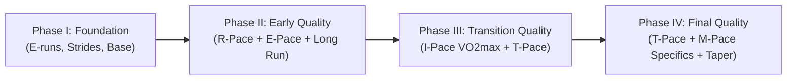

# Jack Daniels' Running Formula (VDOT Coaching System)

The Jack Daniels coaching methodology uses **VDOT** (a physiological index of current running fitness derived from oxygen consumption and running economy) to assign specific, individualized training intensities. Every workout serves a distinct physiological purpose, eliminating "junk miles" and preventing overtraining.

---

## 1. Physiological Training Zones & Purposes

Jack Daniels categorizes all running into 5 primary physiological intensity zones:

| Zone | Label | % VO2max | % Max HR | Primary Physiological Purpose | Max Single Session Volume |
| :--- | :--- | :--- | :--- | :--- | :--- |
| **Easy / Long** | **E** | 62% - 70% | 65% - 79% | Aerobic development, capillary density, mitochondrial growth, cardiac muscle strengthening, musculoskeletal resilience, active recovery. | Up to 25-30% of weekly volume (or max 2.5 hours) |
| **Marathon** | **M** | 80% - 84% | 80% - 88% | Race-specific biomechanics, glycogen sparing, mental familiarity with marathon pace, carbohydrate fueling adaptation. | Max 16-18 miles or 2.5 hours |
| **Threshold** | **T** | 86% - 88% | 88% - 92% | Raises lactate threshold (velocity at ~4.0 mmol/L lactate); comfortably hard effort sustainable for ~60 minutes in a race. | Max 10% of weekly mileage (tempo: 20-40 min; cruise: up to 10-12 km) |
| **Interval** | **I** | 95% - 100% | 98% - 100% | Maximizes aerobic capacity ($\text{VO}_2\text{max}$); high cardiac output stroke volume; bouts lasting 3 to 5 minutes. | Max 8% of weekly mileage (or 10 km, whichever is less) |
| **Repetition** | **R** | 105% - 110% | N/A | Neuromuscular coordination, running economy, stride mechanics, anaerobic alactic power; short bouts (200m–400m) with full recovery. | Max 5% of weekly mileage (or 8 km, whichever is less) |

---

## 2. Pacing Calculation Workflow

To determine or adjust an athlete's training paces:

1. **Obtain Baseline Race Performance**:
   - Use a recent (past 4–8 weeks), honestly raced 5k, 10k, or Half Marathon time.
2. **Calculate VDOT**:
   - Run the VDOT calculator script:
     ```bash
     python scripts/vdot_calculator.py --distance 5k --time "19:30"
     ```
   - Alternatively, cross-reference [VDOT Pace Tables](./references/vdot_pace_tables.md).
3. **Assign Pace Zones**:
   - **E-Pace**: Recovery and base building.
   - **M-Pace**: Marathon pace simulations.
   - **T-Pace**: Steady state 20–30 min or Cruise Intervals (e.g., $5 \times 1\text{ mi @ T}$ with 1 min rest).
   - **I-Pace**: $4 \times 1200\text{m @ I}$ with 3 min jog recovery.
   - **R-Pace**: $8 \times 400\text{m @ R}$ with 400m walking/slow jog recovery.
4. **Pace Adjustment Rule**:
   - Only advance VDOT after an improved race result or after 6–8 weeks of flawless consistency without strain. Never train at aspirational/future goal VDOT.

---

## 3. Periodization Architecture (The 4-Phase System)

For Half Marathon and Marathon athletes, Daniels structures a 16-to-24-week block into four 4-to-6-week phases:



- **Phase I (Foundation & Injury Resistance)**:
  - 100% Easy running + weekly strides ($6 \times 20\text{s}$). Builds aerobic engine and soft tissue strength.
- **Phase II (Early Quality & Economy)**:
  - Introduces **R-Pace** (e.g., $200\text{m}/400\text{m}$ repeats) to develop mechanics and economy before heavy physiological strain, plus weekly Long Run (L).
- **Phase III (Transition Quality & Aerobic Power)**:
  - Focuses on **I-Pace** ($\text{VO}_2\text{max}$) and **T-Pace** cruise intervals. Hardest training block.
- **Phase IV (Final Quality & Event Specificity)**:
  - Shifts to **M-Pace** long runs, continuous **T-Pace** tempos, tune-up races, and a progressive 3-week taper.

---

## 4. Marathon 2Q Program Architecture

For marathoners with busy schedules, Daniels' **2Q (Two Quality)** approach programs exactly two key workouts per week (Q1 and Q2), with all other days filled with relaxed Easy (E) mileage to hit target weekly volume.

- **Q1 (Midweek or Weekend Workout)**: Extensive Threshold, Marathon Pace tempo, or combined workout (e.g., $2\text{ mi E} + 3 \times 2\text{ mi @ T (2 min rest)} + 2\text{ mi @ M} + 1\text{ mi E}$).
- **Q2 (Weekend Long Run)**: Long run with integrated quality (e.g., $18\text{ miles}$: $4\text{ mi E} + 10\text{ mi @ M} + 4\text{ mi E}$).
- **Non-Q Days**: 100% Easy runs at conversational effort, plus 1 rest day.

See full 18-week plan: [Marathon 2Q 18-Week Plan](./examples/marathon_2q_18_week.md).

---

## 5. Half Marathon Specifics

The Half Marathon is raced primarily at **88%–92% $\text{VO}_2\text{max}$** (slightly slower than Daniels' 1-hour Threshold pace for most runners, or right at T-pace for sub-1:15 runners).
- **Primary Workouts**:
  - Cruise Intervals: $4 \times 2\text{ km @ T}$ (90s jog) or $5 \times 1\text{ mi @ T}$ (60s rest).
  - Progressive Long Runs: $14\text{ mi}$ with final $4\text{ mi @ T}$.
  - Alternating intervals: $2\text{ mi E} + 4 \times (1\text{ km @ T} + 1\text{ km @ M}) + 1\text{ mi E}$.

See full 16-week plan: [Half Marathon 16-Week Plan](./examples/half_marathon_16_week.md).

---

## 6. Resources & References

- [VDOT Pace Tables & Formula Specifications](./references/vdot_pace_tables.md)
- [Jack Daniels Complete Workout Catalog](./references/workout_catalog.md)
- [Python VDOT & Pacing Calculator](./scripts/vdot_calculator.py)
