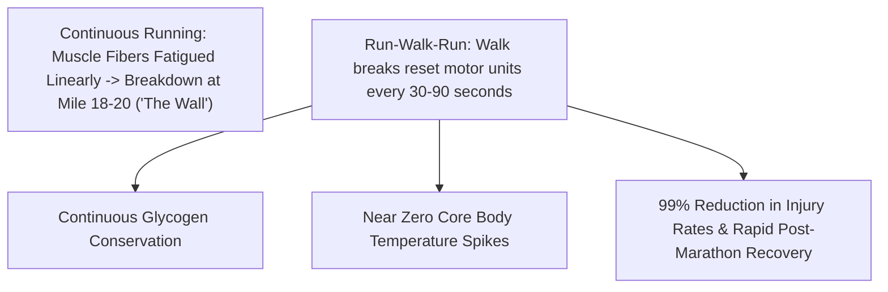

# Jeff Galloway Run-Walk-Run Methodology

Developed by Olympian Jeff Galloway, the **Run-Walk-Run (RWR)** method introduces structured, timed walking breaks from the very first mile of training and racing. By inserting walk breaks before any muscle fatigue sets in, runners protect their musculoskeletal structures, conserve glycogen, and virtually eliminate the marathon "wall".

---

## 1. Core Principles

1. **Take Walk Breaks Early**: Walk breaks are **preventative**, not reactive. If you wait until you are tired to walk, the benefits are lost.
2. **Short, Frequent Intervals**: Shorter run-walk cycles (e.g., Run 30s / Walk 30s) are far more effective than long cycles (e.g., Run 10 min / Walk 1 min).
3. **Over-Distance Long Runs**: Because the orthopedic cost is so low, Galloway programs long runs up to **26 to 29 miles** before the marathon, giving runners 100% confidence they can complete the distance.
4. **Pacing Rule for Long Runs**: Long runs must be run at least **2 minutes per mile (1:15/km) slower** than goal marathon pace.

---

## 2. Magic Mile Time Trial & Ratio Selection

1. **The Magic Mile (MM) Protocol**:
   - Run 1 mile on a track at a hard, sustainable effort after a thorough warm-up.
2. **Formula Predictions**:
   - **5k Pace**: $\text{MM} + 33\text{ seconds}$
   - **10k Pace**: $\text{MM} \times 1.15$
   - **Half Marathon Pace**: $\text{MM} \times 1.20$
   - **Marathon Pace**: $\text{MM} \times 1.30$
3. **Run-Walk-Run Interval Selection**:

| Target Pace | Recommended RWR Ratio Options |
| :--- | :--- |
| **7:00 /mi (4:21 /km)** | Run 4 min / Walk 30s • Run 2 min / Walk 15s • Run 90s / Walk 15s |
| **8:00 /mi (4:58 /km)** | Run 2 min / Walk 30s • Run 90s / Walk 30s • Run 60s / Walk 20s |
| **9:00 /mi (5:35 /km)** | Run 60s / Walk 30s • Run 45s / Walk 30s • Run 30s / Walk 20s |
| **10:00 /mi (6:13 /km)**| Run 45s / Walk 30s • Run 30s / Walk 30s • Run 20s / Walk 20s |
| **11:00 /mi (6:50 /km)**| Run 30s / Walk 30s • Run 20s / Walk 20s • Run 15s / Walk 15s |
| **12:00 /mi (7:27 /km)**| Run 20s / Walk 20s • Run 15s / Walk 15s • Run 10s / Walk 10s |
| **13:00+ /mi (8:05+ /km)**| Run 15s / Walk 15s • Run 10s / Walk 10s • Run 10s / Walk 20s |

---

## 3. Ideal Athlete Profile for Galloway

- **First-time Marathoners / Half-Marathoners**: Guarantees a safe, injury-free finish.
- **Runners prone to chronic injury**: Shin splints, plantar fasciitis, knee arthritis, hamstring tears.
- **Master Runners (45+ years old)**: Maximizes recovery speed between runs.
- **Consistent Finishers**: Runners who regularly "bonk" or walk the final 6 miles of marathons.

---

## 4. Scripts & References

- [Galloway Magic Mile & RWR Calculator Script](./scripts/galloway_calculator.py)
- [Comprehensive Run-Walk Ratios Table](./references/run_walk_ratios.md)
- [Magic Mile and Race Day Strategy Guide](./references/magic_mile_and_race_strategy.md)
- [First-Time Marathon 24-Week Plan](./examples/first_time_marathon_plan.md)
- [Half Marathon Run-Walk-Run 16-Week Plan](./examples/half_marathon_run_walk_plan.md)
