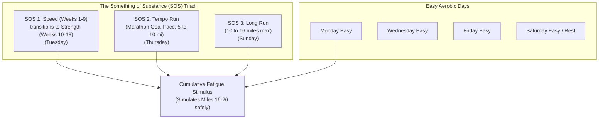

# Hansons Marathon Method (Cumulative Fatigue Coaching System)

Developed by Keith & Kevin Hanson and documented by Luke Humphrey, the Hansons Marathon Method challenges traditional marathon dogma by rejecting the single 20–22 mile long run. Instead, it spreads training volume across 6 days per week, utilizing **cumulative fatigue** to simulate the physical and mental demands of miles 16–26.

---

## 1. Core Philosophy: Cumulative Fatigue & The 16-Mile Cap

In traditional plans, a runner might run 40 miles a week with a 20-mile Sunday run (50% of weekly volume in one day), leading to high injury risk and multiple days of lingering muscle damage.

Hansons addresses this with two strict rules:
1. **The 16-Mile Long Run Cap**: No single run exceeds 16 miles (25.7 km) or 2.5–3 hours. Because the runner starts the long run already tired from midweek SOS workouts, the 16-mile run feels like miles 10 to 26 of the marathon.
2. **Weekly Balance**: The long run should comprise no more than **25% to 33%** of total weekly volume.

---

## 2. The Something of Substance (SOS) Triad

Every training week consists of 3 "SOS" workouts and 3 easy aerobic recovery days (plus 1 optional rest/recovery day):

1. **SOS 1: Speed / Strength (Tuesdays)**:
   - **Weeks 1–9 (Speed)**: 5k/10k pace repeats ($12 \times 400\text{m}$, $8 \times 600\text{m}$, $6 \times 800\text{m}$, $5 \times 1000\text{m}$, $4 \times 1200\text{m}$, $3 \times 1600\text{m}$) with 400m recovery jog. Builds aerobic capacity and biomechanical efficiency.
   - **Weeks 10–18 (Strength)**: 10 seconds per mile (6 sec/km) faster than Marathon Goal Pace ($6 \times 1\text{ mi}$, $4 \times 1.5\text{ mi}$, $3 \times 2\text{ mi}$, $2 \times 3\text{ mi}$) with 400m–800m recovery jog. Builds lactate threshold and specific fatigue resistance.
2. **SOS 2: Tempo Run (Thursdays)**:
   - Run at **EXACT Marathon Goal Pace (MGP)**. Starts at 5 miles in Week 6 and progresses up to 10 continuous miles at MGP by Week 15 (+ 1–2 miles warm-up and cool-down).
   - *Crucial coaching rule*: Never run faster than MGP on tempo days. The goal is neuromuscular groove and pacing discipline.
3. **SOS 3: The Long Run (Sundays)**:
   - Alternates between 10–16 miles at MGP + 30–90 seconds/mile (+19 to +56s/km).

---

## 3. Pacing Guidelines

| Workout Type | Target Pace | Function |
| :--- | :--- | :--- |
| **Tempo** | Exact Marathon Goal Pace (MGP) | Neuromuscular economy & pacing discipline |
| **Strength** | MGP minus 10 sec/mile (-6 sec/km) | Aerobic capacity & lactate clearance |
| **Speed** | Current 5k to 10k race pace | Neuromuscular turnover & $\text{VO}_2\text{max}$ |
| **Long Run** | MGP + 30s to 90s per mile (+19 to +56s/km) | Extended time on feet on pre-fatigued legs |
| **Easy / Recovery**| MGP + 60s to 120s per mile (+37 to +75s/km) | Active recovery without tissue breakdown |

---

## 4. Half Marathon Adaptation

In the **Hansons Half Marathon Method**:
- Long runs top out at **12 miles** (19 km).
- Tempo runs are run at **Half Marathon Goal Pace (HGP)**, progressing from 3 miles to 7 miles.
- Speed workouts are 5k pace; Strength workouts are ran at 10s/mile faster than HGP (approx. 10k pace).

---

## 5. Scripts & References

- [Hansons Pace & SOS Workout Calculator](./scripts/hansons_calculator.py)
- [Cumulative Fatigue Theory Reference](./references/cumulative_fatigue_theory.md)
- [SOS Workout Guide & Progression Rules](./references/sos_workout_guide.md)
- [Hansons Advanced Marathon 18-Week Plan](./examples/marathon_advanced_18_week.md)
- [Hansons Half Marathon 18-Week Plan](./examples/half_marathon_18_week.md)
