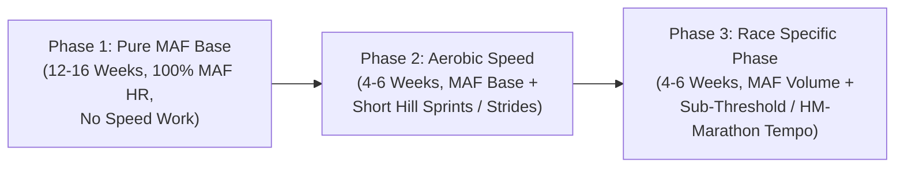

# Dr. Phil Maffetone's Method (Maximum Aerobic Function / MAF 180)

The Maffetone Method focuses on maximizing the human body's fat-burning aerobic engine while minimizing anaerobic stress, inflammation, and cortisol. By strictly capping running intensity to the **MAF Heart Rate**, athletes build massive aerobic efficiency, prevent overtraining syndrome, and dramatically reduce running-related injuries.

---

## 1. The MAF 180 Formula

To calculate the Maximum Aerobic Function (MAF) heart rate ceiling:
$$\text{MAF Heart Rate} = 180 - \text{Age} + \text{Category Modifier}$$

| Category | Health / Training Status | Modifier |
| :--- | :--- | :--- |
| **Category 1** | Recovering from major illness (heart disease, surgery, COVID complications) or chronic medication. | **$-10\text{ bpm}$** |
| **Category 2** | Injured, regressing in pace, frequent colds/allergies, asthma, or training inconsistently ($< 1$ year). | **$-5\text{ bpm}$** |
| **Category 3** | Training consistently for 1–2 years without injury or illness, progressing steadily. | **$0\text{ bpm}$ (No change)** |
| **Category 4** | Training consistently for 2+ years without injury, competing and making continuous progress. | **$+5\text{ bpm}$** |

### The Target Training Zone
- **Ceiling**: MAF Heart Rate (e.g., $145\text{ bpm}$ for a healthy 35-year-old).
- **Optimal Range**: $\text{MAF} - 10\text{ bpm}$ to $\text{MAF}$ (e.g., $135 - 145\text{ bpm}$).
- **Absolute Rule**: If heart rate reaches the MAF ceiling (even on steep hills), the runner must slow down or walk until HR drops by $5\text{ bpm}$.

---

## 2. The MAF Test (Monitoring Fitness Progress)

Because pace is never forced in MAF training, aerobic progress is measured via the standardized **MAF Test**:

1. **Protocol**:
   - Location: 400m track or flat paved loop.
   - Warm-up: 15 minutes of walking/easy jogging bringing HR up to $\text{MAF} - 10\text{ bpm}$.
   - Main Test: Run 5 miles (8 km) continuously at **exact MAF Heart Rate** ($\pm 1-2\text{ bpm}$).
   - Recording: Record the exact split time for each mile/km.
2. **Interpretation**:
   - As aerobic enzymes and fat oxidation improve, the runner will run each mile **faster at the exact same heart rate**.
   - A healthy aerobic engine will show steady improvement of 10–30 seconds/mile faster over 3 to 6 months.

---

## 3. Periodization: Pure Aerobic Base into Race Specifics

- **Phase 1: Pure Aerobic Base (12–16 Weeks)**:
  - 100% of runs conducted between $\text{MAF}-10$ and $\text{MAF}\text{ bpm}$. Zero anaerobic intervals.
- **Phase 2: Neuromuscular Speed (4–6 Weeks)**:
  - Base runs remain at MAF; add $6 \times 10-15\text{s}$ steep hill sprints (alactic, full recovery) to maintain muscle power without anaerobic glycolysis.
- **Phase 3: Specific Marathon / Half Marathon Prep (4–6 Weeks)**:
  - Long runs extended to 18–22 miles at MAF; optional weekly marathon pace tempo.

---

## 4. Scripts & References

- [MAF 180 Calculator Script](./scripts/maf_calculator.py)
- [MAF 180 Rules and MAF Test Protocols](./references/maf_180_rules_and_tests.md)
- [Aerobic Base Progression and Nutrition Guide](./references/aerobic_base_progression.md)
- [MAF Marathon 16-Week Training Plan](./examples/maf_marathon_16_week.md)
