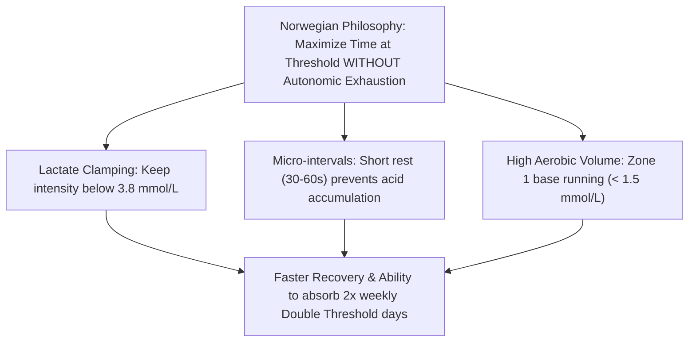

# The Norwegian Endurance Training Model (Sub-Threshold & Double Threshold)

Pioneered by Marius Bakken and popularized by the Ingebrigtsen family, the Norwegian method has transformed endurance running. Instead of high-acidosis, exhausting $\text{VO}_2\text{max}$ interval sessions, it emphasizes **high-volume sub-threshold work** tightly controlled by blood lactate sampling ($< 3.8\text{ mmol/L}$) or heart rate reserve.

---

## 1. Physiological Core Principles

1. **Lactate Clamping**: Workouts are kept strictly below the point of exponential lactate accumulation ($\sim 4.0\text{ mmol/L}$). This allows the runner to log $15\text{ to }25\text{ km}$ of threshold work in a single day without systemic nervous system breakdown.
2. **Double Threshold (DT) Days**: Running threshold in both the morning (AM) and evening (PM) doubles the gene expression for mitochondrial biogenesis (PGC-1$\alpha$) in a 24-hour cycle.
3. **Controlled Rest Periods**: Work bouts use short rest intervals (e.g., $25 \times 400\text{m}$ with 30s rest or $10 \times 1\text{ km}$ with 45–60s rest) to keep heart rate and oxygen consumption elevated while lactate stays level.

---

## 2. Threshold Intensity Zones

| Session Slot | Target Blood Lactate | Equivalent Pace Range | Typical Formats | Rest Duration |
| :--- | :--- | :--- | :--- | :--- |
| **AM Lower Threshold** | $2.0 - 2.8\text{ mmol/L}$ | Half Marathon to 15k pace | $5-6 \times 6\text{ min}$, $4-5 \times 2\text{ km}$, $3 \times 3\text{ km}$ | 60 seconds standing/jog |
| **PM Upper Threshold** | $3.0 - 3.8\text{ mmol/L}$ | 10k to 15k pace | $20-25 \times 400\text{m}$, $10-12 \times 1\text{ km}$, $6 \times 1500\text{m}$ | 30–60 seconds standing/jog |
| **Easy Aerobic Days** | $< 1.5\text{ mmol/L}$ | Conversational Easy (65–75% HR) | 50–80 min continuous | N/A |
| **Marathon Specific Long** | $1.8 - 2.5\text{ mmol/L}$ | Marathon Goal Pace (MP) | $32\text{ km}$ with $2 \times 8\text{ km @ MP}$ or $3 \times 5\text{ km @ MP}$ | 1 km easy float |

---

## 3. Marathon & Half Marathon Adaptation

While track runners use 2 to 3 Double Threshold days per week, the **Marathon / Half Marathon Adaptation** balances threshold work with muscular endurance and glycogen management:

### Weekly Microcycle Structure
- **Monday**: Easy Recovery ($60\text{ min}$) + $6 \times 100\text{m}$ strides
- **Tuesday (Double Threshold Day)**:
  - **AM**: $5 \times 6\text{ min @ } 2.2-2.6\text{ mmol/L}$ (60s rest)
  - **PM**: $10 \times 1\text{ km @ } 3.2-3.6\text{ mmol/L}$ (60s rest)
- **Wednesday**: Easy Aerobic ($75\text{ min}$)
- **Thursday (Single Threshold or Sub-Threshold)**:
  - $4 \times 3\text{ km @ Lower Threshold / HM Pace}$ (90s rest)
- **Friday**: Easy Recovery ($50\text{ min}$)
- **Saturday**: Easy Pre-Long Run ($45\text{ min}$)
- **Sunday (Specific Endurance Long Run)**:
  - $30-34\text{ km}$ with $3 \times 6\text{ km @ Marathon Pace}$ (with 1 km easy float)

---

## 4. Scripts & References

- [Norwegian Sub-Threshold Calculator Script](./scripts/norwegian_calculator.py)
- [Double Threshold Protocol & Execution Rules](./references/double_threshold_protocol.md)
- [Lactate Testing & Heart Rate Zone Calibration](./references/lactate_and_hr_zones.md)
- [16-Week Marathon Threshold Block Plan](./examples/marathon_threshold_block.md)
- [12-Week Half Marathon Threshold Plan](./examples/half_marathon_threshold_plan.md)
