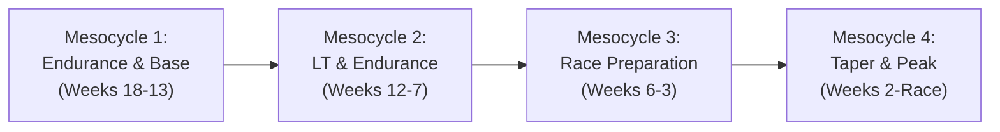

# Pete Pfitzinger Running Methodology (Advanced Marathoning & Faster Road Racing)

The Pete Pfitzinger ("Pfitz") system is renowned for building immense aerobic resilience and high fatigue resistance. It relies on four core pillars:
1. **Lactate Threshold (LT) Development**: Shifting the onset of blood lactate accumulation to faster paces.
2. **Medium-Long Runs (MLR)**: A midweek staple of 11 to 15 miles (18–24 km) that stimulates aerobic enzymes and glycogen storage without weekend long-run fatigue.
3. **Progressive Long Runs (LR)**: Long runs that start comfortably and naturally accelerate toward 10% slower than marathon pace, with selective blocks run directly at Marathon Pace (MP).
4. **Tune-Up Races (8k–15k)**: High-intensity race simulations during the peak mesocycle to gauge fitness and sharpen anaerobic capacity.

---

## 1. Pfitzinger Training Intensities

| Zone | % Max HR | % HRR | Typical Pace Target | Purpose |
| :--- | :--- | :--- | :--- | :--- |
| **Recovery** | < 76% | < 70% | Easy conversational (+60 to +90s/mi over MP) | Active recovery, tissue repair, minimal stress. |
| **General Aerobic (GA)** | 70% - 81% | 62% - 75% | Moderate aerobic (+45 to +75s/mi over MP) | Building aerobic base, routine volume days. |
| **Endurance (Long / MLR)**| 73% - 84% | 65% - 78% | Start +20% slower than MP, progress to +10% slower | Glycogen sparing, capillarization, mental stamina. |
| **Marathon Pace (MP)** | 82% - 88% | 73% - 84% | Target Marathon Pace | Specific pacing mechanics, metabolic adaptation. |
| **Lactate Threshold (LT)** | 85% - 91% | 77% - 88% | 15k to Half Marathon race pace (~1-hour pace) | Improving lactate clearance and threshold velocity. |
| **VO2max (5k/3k Pace)** | 93% - 98% | 90% - 95% | 3k to 5k race pace | Aerobic capacity, late-cycle sharpening. |

---

## 2. Mesocycle Structure

A standard Pfitzinger 18-week marathon or 12-week half-marathon plan progresses through 4 distinct mesocycles:

1. **Mesocycle 1: Endurance (Weeks 18–13)**:
   - Focus: Establishing volume, introducing strides ($6 \times 100\text{m}$), building long runs up to 16–18 miles, and establishing midweek MLRs.
2. **Mesocycle 2: Lactate Threshold + Endurance (Weeks 12–7)**:
   - Focus: Key LT tempo runs (4 to 7 miles @ LT pace) + Marathon Pace long runs (e.g., 16 mi with 10 mi @ MP, 18 mi with 14 mi @ MP).
3. **Mesocycle 3: Race Preparation (Weeks 6–3)**:
   - Focus: Peak mileage, 20–22 mile long runs, VO2max sharpening ($5 \times 1000\text{m}$ or $5 \times 800\text{m}$), and two to three 8k–15k tune-up races on Saturdays followed by Sunday long runs.
4. **Mesocycle 4: Taper & Peak (Final 3 Weeks)**:
   - Focus: Exponential volume reduction (-20%, -40%, -60%) while maintaining short LT/MP intensity touches to retain muscle tension and peak freshness.

---

## 3. The Midweek Medium-Long Run (MLR)

The **Medium-Long Run (MLR)** (typically 11–15 miles / 18–24 km) performed on Tuesday or Wednesday is Pfitzinger's signature training element:
- **Why it works**: Running a 90-minute run in the middle of a working week creates a substantial glycogen depletion stimulus. When the runner attempts the weekend long run 3–4 days later, the body adapts rapidly to fat oxidation.
- **Execution rule**: Do not run MLRs too fast. Start in the lower endurance zone (73% Max HR) and allow pace to progress naturally to ~80-84% Max HR in the second half.

---

## 4. Half Marathon Modifications (Faster Road Racing)

In Pfitz's Half Marathon schedules (12/47, 12/63, 12/84):
- LT runs remain the #1 priority (e.g., 38 to 44 minutes total LT volume, such as $2 \times 20\text{ min @ LT}$ or $4 \times 1.5\text{ mi @ LT}$).
- Long runs top out at 14–16 miles (22–26 km).
- Speed sessions emphasize VO2max ($5 \times 1000\text{m}$, $6 \times 800\text{m}$) and Progression runs.

---

## 5. Scripts & References

- [Pfitzinger Training Zone & Plan Generator Script](./scripts/pfitz_planner.py)
- [Training Zones & MLR Guide](./references/training_zones_and_mlr.md)
- [Mesocycle Periodization Guide](./references/mesocycle_guide.md)
- [Marathon 18/55 Plan Template](./examples/marathon_18_55.md)
- [Marathon 18/70 Plan Template](./examples/marathon_18_70.md)
- [Half Marathon 12/63 Plan Template](./examples/half_marathon_12_63.md)
