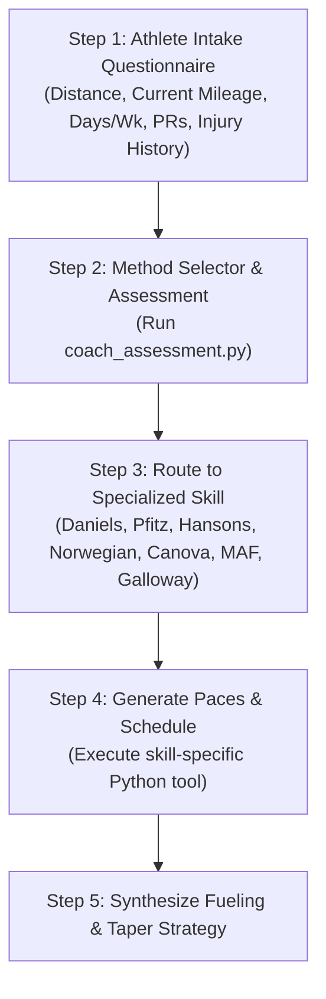

# Master Running Coach Orchestrator

The **Running Coach Orchestrator** is the top-level consultation and intake skill. It conducts an athlete diagnostic, evaluates training history and physiological goals, routes the runner to the optimal specialized training methodology skill, and synthesizes fueling, tapering, and injury-prevention protocols.

---

## 1. Athlete Consultation & Intake Workflow

When a runner asks for advice or a custom plan:



### Diagnostic Assessment Command:
```bash
python scripts/coach_assessment.py --race marathon --mileage 45 --days 5 --goal pr --hr-monitor
```

---

## 2. Methodology Decision Matrix

| Methodology | Primary Strength | Ideal Runner Profile | Long Run Philosophy | Weekly Frequency |
| :--- | :--- | :--- | :--- | :--- |
| **Jack Daniels (VDOT)** | Mathematical precision, individual paces (E/M/T/I/R), 2Q flexibility | Busy professionals, data-driven runners, 5k to Marathon racers | 2Q program: Long run with integrated M or T pace | 4 to 6 days/wk |
| **Pete Pfitzinger (Pfitz)** | High endurance resilience, lactate threshold density, midweek MLRs | Intermediate-to-advanced runners targeting Boston Qualifier (BQ) or PR | Progressive long runs up to 21–22 miles + 11–15 mi MLRs | 5 to 6 days/wk |
| **Hansons Method** | Cumulative fatigue, no single exhausting 20+ miler | Runners who struggle with 20+ mile recovery, disciplined schedule | **Capped at 16 miles** (or 2.5-3.0 hrs max); 25-33% weekly volume | **Strictly 6 days/wk** |
| **Norwegian Method** | Massive threshold volume without autonomic nervous system breakdown | Runners with heart rate monitors or lactate meters aiming for high efficiency | Sub-threshold micro-intervals + specific marathon pace long blocks | 5 to 7 days/wk |
| **Renato Canova** | Peak race-specific speed endurance (95–102% MP) | Sub-elite & competitive runners with high volume base (65+ mpw) | Long Fast Runs (28–35 km) + Special Blocks (double workouts) | 6 to 7 days/wk |
| **Phil Maffetone (MAF)** | Pure aerobic base building, zero burnout, fat adaptation | Overtrained, injury-recovering, or low-heart-rate base builders | Continuous easy running capped at $(180 - \text{age})$ HR | 4 to 6 days/wk |
| **Jeff Galloway** | Eliminates hitting the wall, prevents soft tissue injuries | First-time finishers, master runners, injury-prone athletes | Over-distance (up to 26–29 mi) with strict Run-Walk-Run intervals | 3 to 4 days/wk |

---

## 3. Specialized Skills Catalog

When deep-diving into a specific methodology, route to the corresponding skill:

- [Jack Daniels' Running Formula (`daniels-running-formula`)](../daniels-running-formula/SKILL.md)
- [Pete Pfitzinger Marathoning (`pfitzinger-marathoning`)](../pfitzinger-marathoning/SKILL.md)
- [Hansons Marathon Method (`hansons-marathon-method`)](../hansons-marathon-method/SKILL.md)
- [Norwegian Endurance Method (`norwegian-endurance-method`)](../norwegian-endurance-method/SKILL.md)
- [Renato Canova Method (`canova-marathon-method`)](../canova-marathon-method/SKILL.md)
- [Phil Maffetone Low-HR Method (`maffetone-low-hr-method`)](../maffetone-low-hr-method/SKILL.md)
- [Jeff Galloway Run-Walk Method (`galloway-run-walk-method`)](../galloway-run-walk-method/SKILL.md)

---

## 4. Master References

- [Methodology Comparison Matrix & Decision Flowchart](./references/methodology_comparison_matrix.md)
- [Athlete Intake & Physiological Questionnaire](./references/athlete_intake_framework.md)
- [Marathon & Half Marathon Fueling & Tapering Master Guide](./references/fueling_and_taper_guide.md)
- [Hybrid Case Studies (MAF Base into Pfitz Build / Daniels 2Q Peak)](./examples/hybrid_master_coaching_case_studies.md)
