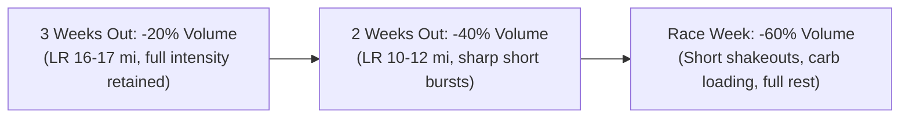

# Marathon & Half Marathon Fueling and Tapering Master Guide

This reference provides evidence-based guidelines for carbohydrate loading, in-race fueling, hydration, and the tapering phase.

---

## 1. Marathon In-Race Fueling Strategy

The human body stores approximately **1,800 to 2,000 kcal** of muscle and liver glycogen—enough for roughly 90–120 minutes of hard running. In a marathon, exogenous carbohydrate ingestion is non-negotiable to avoid the wall.

### In-Race Nutrition Matrix
- **Target Carbohydrate Rate**: **60 to 90 grams of carbohydrate per hour** (using 2:1 glucose-to-fructose or 1:0.8 maltodextrin-to-fructose formulations).
- **Gel Cadence**:
  - 1 energy gel (25–30g carbs) every **25 to 30 minutes** starting at minute 30.
  - Ingest with 100–150 ml of plain water at aid stations (never with sports drinks to avoid hypertonic GI distress).
- **Electrolytes & Sodium**:
  - Aim for **400 to 700 mg sodium per hour** (via electrolyte drink or salt caps), adjusted for ambient temperature and sweat rate.

### Half Marathon Fueling
- **Target Carbohydrate Rate**: **30 to 45 grams per hour**.
- Ingest 1 gel at minute 45 (or between miles 5–7) + fluid at water stations.

---

## 2. The 3-Day Marathon Carbohydrate Load

- **Timing**: 36 to 48 hours prior to race start (Thursday morning to Saturday dinner for a Sunday race).
- **Target Ingestion**: **8 to 10 grams of carbohydrate per kilogram of body weight per day**.
- **Nutritional Focus**: Low-fiber, low-fat, easily digestible carbohydrates (white rice, pasta, bagels, potatoes, pancakes, fruit juice, sports drinks, pretzels).
- **Hydration**: Every 1 gram of stored glycogen binds approximately 3 grams of water; slight weight gain (1–2 kg) is normal and desirable.

---

## 3. The 3-Week Progressive Taper Architecture

1. **Volume Reduction**: Reduce total weekly volume exponentially while maintaining workout frequency to preserve neuromuscular rhythm.
2. **Preserve Intensity**: Keep intervals and tempo strides at true race pace, but reduce the total repetitions by 50–70% to prevent muscular fatigue while keeping muscle tone crisp.
3. **Rest & Sleep**: Prioritize 8–9 hours of sleep nightly, particularly two nights before the race (Friday night before Sunday race).
