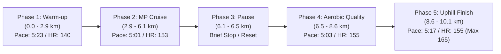

# Workout Analysis Report: W01 Wednesday Medium Run (10.11 km)

- **Date**: Wednesday, September 2, 2026
- **Activity File**: `2026-09-02-i182555395_intervals.csv`
- **Report File**: `2026-09-02-i182555395_intervals.md`
- **Athlete Calibration**: Rest HR 42 bpm | Max HR 187 bpm | Threshold ~4:20-4:30/km @ 170 bpm | Goal Marathon Pace: 4:58/km (3:29:34)

---

## 📊 Executive Performance Dashboard

| Metric | Recorded Value | Target / Baseline | Coaching Evaluation |
| :--- | :--- | :--- | :--- |
| **Total Distance** | **10.09 km (10.11 km GPS)** | 11.0 km (Pfitz) / 8.0 km (Hansons) | 🟢 **On Target** (-0.9 km vs Pfitz / +2.1 km vs Hansons) |
| **Elapsed Moving Time**| **54 min 19 sec** | ~55–60 min | 🟢 **Exact Duration** |
| **Average Pace** | **5:23 min/km (8:40/mi)** | 5:30 – 5:35 min/km | 🟢 **Aerobically Crisp** (slightly fast for pure easy) |
| **Grade Adjusted Pace (GAP)**| **5:14 min/km (8:25/mi)** | 5:30 min/km | 🔵 **Elevated Effort** due to +50m rolling elevation |
| **Average Heart Rate** | **149.2 bpm (79.8% Max / 73.8% HRR)** | 136 – 156 bpm (Endurance Zone) | 🟢 **Well within aerobic endurance ceiling** |
| **Peak Heart Rate** | **165 bpm** | 170 bpm (Threshold) | 🟢 **Never crossed lactate threshold** |
| **Average Cadence** | **176.0 spm** | 174 – 180 spm | 🌟 **Optimal running cadence** |
| **Average Power** | **365.9 W** | Flat Baseline ~350–370W | 🟢 **Very steady mechanical output** |
| **Vertical Oscillation** | **9.69 cm (96.9 mm)** | < 10.0 cm | 🌟 **Low vertical bounce** |
| **Vertical Ratio** | **8.92%** | < 9.0% | 🌟 **Elite mechanical efficiency** |
| **Ground Contact Balance**| **50.8% Left / 49.2% Right** | 50.0 / 50.0 | 🌟 **Symmetrical balance (< 1% variance)** |

---

## 🎯 Workout Intent vs. Execution

### 1. Pfitzinger Framework (Scheduled: 11 km @ 5:30 MLR)
- **Score: 9.5 / 10 (Excellent Execution)**
- In Pete Pfitzinger's methodology, the Wednesday **Medium-Long Run (MLR)** is an endurance stimulus designed to start relaxed (+20% slower than MP) and progress toward 10% slower than MP (around 5:25–5:30/km).
- You followed this progression naturally: starting at 5:33/km (135 bpm), settling into 5:18–5:26/km, and then spending substantial time between 4:52–5:05/km in the middle third while holding heart rate strictly under 158 bpm.

### 2. Hansons Framework (Scheduled: 8 km @ 5:35 Easy)
- **Score: 8.0 / 10 (Caution on Easy Days)**
- In Hansons, cumulative fatigue relies on keeping Wednesday truly easy (MGP + 1:00 to 2:00 min/mile, or ~5:35–6:13/km) because Thursday features a mandatory Marathon Goal Pace tempo.
- While your cardiovascular system handled 5:23/km easily (HR 149 bpm), running 10 km instead of 8 km at 5:23 pace creates slightly higher neuromuscular load. If following Hansons, keep non-SOS runs locked closer to 5:35–5:45/km.

---

## 📈 5-Phase Segment Breakdown



### Phase 1: Warm-up & Aerobic Settling (0.0 km to 2.93 km / Splits #1–#6)
- **Pace Range**: 5:14 – 5:33 min/km (Avg ~5:23/km)
- **Heart Rate**: 135 – 143 bpm (Avg ~140 bpm | 67% HRR)
- **Analysis**: Disciplined aerobic start. Initial +2.7% grade in the first 400m was absorbed at 5:33 without an erratic heart-rate spike (average 135 bpm). Stride length opened up smoothly from 1.03m to 1.07m.

### Phase 2: Marathon Pace Cruise Block (2.93 km to 6.14 km / Splits #7–#12)
- **Pace Range**: 4:52 – 5:05 min/km (**Average: 5:01 min/km**)
- **Heart Rate**: 147 – 156 bpm (Avg ~153 bpm | 76% HRR)
- **Power**: 344 – 368 W
- **Key Coaching Finding**: **This is the standout section of the run.** Your target Rome Marathon race pace is **4:58 min/km**. Across these 3.2 kilometers, you held an average pace of **5:01 min/km** while your heart rate averaged just **153 bpm** (climbing to 156 bpm). 
  - Your calibrated MP Heart Rate Zone is **153 – 165 bpm**. 
  - Operating at the very bottom of your marathon HR zone while running within 3 seconds of goal pace demonstrates **strong baseline aerobic efficiency**.

### Phase 3: Mid-Run Reset / Pause (6.14 km to 6.46 km / Split #13)
- **Distance**: 321m | **Pace**: 7:03 min/km | **GAP**: 5:25 min/km | **HR**: 146 bpm | **Stride**: 0.78m
- **Observation**: Brief pause / traffic crossing / water sip. Heart rate dropped quickly from 156 bpm to 146 bpm, showing fast autonomic cardiac recovery.

### Phase 4: Sustained Aerobic Quality (6.46 km to 8.58 km / Splits #14–#17)
- **Pace Range**: 4:56 – 5:11 min/km (Avg ~5:03/km)
- **Heart Rate**: 151 – 158 bpm
- **Analysis**: Re-established pace immediately after the pause. Stride length expanded back to 1.08–1.11m with vertical ratio staying low at 8.4–8.8%.

### Phase 5: Controlled Rolling & Uphill Finish (8.58 km to 10.11 km / Splits #18–#20)
- **Pace Range**: 5:13 – 5:20 min/km
- **Final Split (#20)**: +2.3% gradient climb (11m elevation gain), 417W power, GAP 5:02/km, HR peaked at 165 bpm.
- **Analysis**: You tackled the final hill with strong mechanical drive (417W) while staying below your 170 bpm threshold. Excellent mental and muscular finish.

---

## 💓 Heart Rate Zone Distribution Breakdown

```text
[Recovery (<142 bpm)]       █████ (25.0% - 13.6 min)
[General Aerobic (142-152)] ██████ (30.0% - 16.3 min)
[Marathon Pace (153-165)]   █████████ (45.0% - 24.4 min)
[Lactate Threshold (>165)]  (0.0% - 0.0 min)
```

- **Aerobic Integrity**: 100% of the workout was executed below your lactate threshold (170 bpm).
- **Cardiac Drift**: Comparing Phase 2 (5:01/km @ 153 bpm) to Phase 4 (5:03/km @ 155 bpm), cardiac drift was under **1.3%** across 54 minutes. This indicates good hydration and robust aerobic base stability.

---

## 🔬 Biomechanical & Running Economy Analysis

### 1. Cadence & Stride Dynamics (176 spm / 1.05m Stride)
- A cadence of **176 spm** at 5:20 pace is text-book. It keeps ground contact times short and prevents overstriding.
- As pace accelerated to sub-5:00/km, stride length naturally lengthened from 1.03m to 1.13m while cadence remained stable.

### 2. Vertical Ratio (8.92%) & Vertical Oscillation (9.69 cm)
- Vertical Ratio measures the "cost" of forward motion: $\text{Vertical Ratio} = \frac{\text{Vertical Oscillation}}{\text{Stride Length}}$.
- **Industry Benchmarks**:
  - $> 10.0\%$: Inefficient (excessive vertical bouncing).
  - $8.0\% - 9.0\%$: **Elite / Highly Efficient** (energy directed horizontally).
- Your **8.92%** indicates that you are not wasting energy bouncing into the air; energy is channeled into forward propulsion.

### 3. Ground Contact Balance (50.8% L / 49.2% R)
- Less than 1% asymmetry between left and right foot contact. 
- Symmetry is vital for the **Rome Marathon cobblestones (*Sanpietrini*)**, where any structural imbalance can quickly aggravate the plantar fascia or Achilles tendon.

---

## 🏛️ Rome Marathon Takeaways & Next Steps

1. **Sub-3:30 (4:58/km) Reality Check**:
   - Holding 5:01/km for over 3 km at an average HR of 153 bpm confirms that **4:58 min/km is a realistic goal**.
   - Your current threshold of 4:20–4:30/km provides a comfortable 30–35 second buffer above marathon pace.
2. **Upcoming W01 Workouts**:
   - **Friday (Sep 04)**: Keep recovery strictly easy (6.5 km @ 5:50–6:00/km, HR $< 142\text{ bpm}$).
   - **Saturday (Sep 05)**: General Aerobic + $6 \times 100\text{m}$ strides (practice quick turnover on flat ground).
   - **Sunday (Sep 06)**: First Long Run of the cycle (**13 km Pfitz / 11 km Hansons**). Target a controlled, progressive pace (start @ 5:40/km, finish @ 5:20/km, average HR $\le 150\text{ bpm}$).
