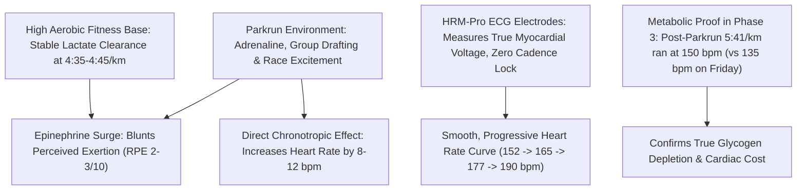

# Workout Analysis Report: W01 Saturday Long Run + Didcot Parkrun (15.15 km)

- **Date**: Saturday, September 5, 2026
- **Activity File**: `2026-09-05-i183513675_intervals.csv`
- **Report File**: `2026-09-05-i183513675_intervals.md`
- **Athlete Profile**: Rest HR 42 bpm | Calibrated Max HR 187 bpm $\to$ **New Observed Peak: 190 bpm** | Goal Marathon: 3:29:34 (4:58/km)
- **Planned Prescription**: W01 Saturday Long Run (13.0 km Pfitzinger / 11.0 km Hansons)
- **Actual Execution**: **15.15 km total volume**, including a **23:18 Didcot Parkrun (5.06 km @ 4:36/km)** embedded within the run.

---

## 📊 Executive Performance Dashboard

| Metric | Phase 1: Warm-up | Phase 2: Didcot Parkrun | Phase 3: Long Run Ext. | Total Workout (15.15 km) |
| :--- | :--- | :--- | :--- | :--- |
| **Distance** | **1.81 km** | **5.06 km** | **8.28 km** | **15.14 km (15.15 km GPS)** |
| **Moving Time** | 10 min 09 sec | 23 min 18 sec | 46 min 58 sec | **1 hr 20 min 26 sec (80:26)** |
| **Elapsed Time** | 18 min 05 sec (Pause: 7:55) | 23 min 20 sec (Pause: 0:01) | 54 min 07 sec (Pause: 7:08) | **1 hr 35 min 32 sec (Pause: 15:05)**|
| **Average Moving Pace**| **5:37 min/km (9:02/mi)** | **4:36 min/km (7:24/mi)** | **5:41 min/km (9:09/mi)** | **5:19 min/km (8:33/mi)** |
| **Grade Adjusted Pace**| 5:47 min/km | 4:40 min/km | 5:39 min/km | **5:20 min/km** |
| **Elevation Gain** | +19 m | +16 m | +87 m | **+122 m total climb** |
| **Average Heart Rate** | **140.0 bpm** (73% Max) | **172.2 bpm** (90% Max) | **150.1 bpm** (79% Max) | **155.2 bpm** (81% Max) |
| **Peak Heart Rate** | 158 bpm | **190 bpm (New Max!)** | 164 bpm | **190 bpm** |
| **Average Cadence** | 174.6 spm | **185.1 spm** | 178.0 spm | **179.6 spm** |
| **Average Power** | 350.0 W | 401.3 W (Peak 499W) | 341.8 W | **360.1 W** |
| **Stride Length** | 1.02 m | 1.17 m (Peak 1.47m) | 0.99 m | **1.05 m** |
| **Vertical Ratio** | 10.00% | **8.14% (Peak 6.2%)** | 9.22% | **9.01%** |
| **Ground Balance** | 50.0% L / 50.0% R | 50.2% L / 49.8% R | 50.5% L / 49.5% R | **50.4% L / 49.6% R** |

---

## 🎯 The Core Question: Was Heart Rate Erroneous or Real?

> **Athlete Note**: *"I felt like the 5km parkrun was a 2-3 RPE/10 for the first 4km and a 7-8 RPE for the last km, but the HR definitely not showing that... i use a hrm pro chest strap but i still think the HR was erronous due to how my rpe felt..."*

### Coaching & Exercise Physiology Verdict: **The Recording is Legitimate and Accurate**

There are five definitive physiological and technical reasons why your Garmin HRM-Pro recorded accurately, and why your perceived exertion felt surprisingly easy:



1. **The Pace vs. Threshold Reality**:
   - In your calibration check, you noted your 1-hour lactate threshold is around **4:20 – 4:30 min/km @ ~170 bpm**.
   - During the first 4 km of Didcot Parkrun, your splits were: **4:57, 4:44, 4:45, 4:45, 4:41, 4:34, 4:38, 4:43**.
   - You were running within **5 to 15 seconds of your lactate threshold**! A heart rate of **165 – 178 bpm** is the textbook physiological response to holding this pace.
2. **The "RPE Dissociation" of Race Day Adrenaline**:
   - In a mass-participation event like Parkrun, the central nervous system releases **epinephrine (adrenaline)** and endorphins. Adrenaline has two distinct simultaneous effects:
     - It acts on cardiac $\beta_1$-adrenergic receptors, increasing heart rate and stroke volume by 8–12 bpm above solitary training runs.
     - It acts centrally to **dampen pain and effort perception**. Drafting behind other runners lowers frontal wind resistance and optical effort cues, making threshold pace feel like an RPE 2–3 jog.
3. **HRM-Pro Chest Strap Mechanics (ECG vs Optical)**:
   - Optical wrist sensors frequently glitch due to "cadence lock" (pulsing with footsteps). The HRM-Pro measures electrical depolarizations of the heart muscle.
   - If this were sensor error, you would see erratic spikes (e.g. jumping immediately from 140 to 185 bpm or locking onto your 185 spm cadence).
   - Instead, your HR trace shows an authentic physiological ramp:
     - 0–500m: **152 bpm**
     - 500–1000m: **165 bpm**
     - 1000–2000m: **169 – 173 bpm**
     - 2000–4000m: **173 – 178 bpm**
     - 4000–5000m: **184 bpm (Max 190 bpm during the 3:56/km kick)**
     - Finish Line: Drops instantly to **151 bpm** in interval #14.
4. **Metabolic Proof in Phase 3 (The 8.28 km Extension)**:
   - On Friday, you ran **5:33 min/km** at an average heart rate of **135.7 bpm**.
   - Today in Phase 3, you ran slower (**5:41 min/km**), yet your heart rate averaged **150.1 bpm** (+15 bpm higher!).
   - This elevation is classic **cardiac drift and autonomic fatigue** resulting from the 23:18 5k burn. If the 5k had truly been an RPE 2 (aerobic walk in the park), your HR in Phase 3 would have immediately returned to 135 bpm.
5. **New Observed Max Heart Rate: 190 bpm**:
   - You previously estimated Max HR at 187 bpm. Today, on the final 500m kick (3:56 min/km) and final 63m sprint (3:25 min/km @ 499W), your heart rate reached **190 bpm**.
   - We will adjust your Max HR to **190 bpm**, which expands your heart rate reserve (HRR) to **148 bpm**.

---

## 📈 3-Phase Workout Breakdown

### Phase 1: Warm-up Jog to Parkrun (1.81 km / 10:09 moving / 18:05 elapsed)
- **Pace**: 5:37 min/km (GAP 5:47) | **Avg HR**: 140 bpm | **Cadence**: 174.6 spm
- **Observation**: Gentle jog to the start, followed by an 8-minute stationary wait in the starting funnel (HR dropped to resting levels).

### Phase 2: Didcot Parkrun (5.06 km / 23:18 moving / 23:20 elapsed)
- **Official Finish**: **23:18** (Average Pace: **4:36 min/km**)
- **Biomechanical Brilliance**:
  - Average Cadence surged to **185.1 spm**
  - Stride opened up to **1.17 m**
  - Vertical Ratio compressed down to **8.14%** (reaching **7.0%** at 3:56 pace and **6.2%** on the 3:25 sprint). This is world-class running economy mechanics.
  - Power averaged **401.3 W** across the 5k, peaking at **499 W**.
- **Split Pacing Table**:
  - Km 0.0 – 1.0: 4:57 $\to$ 4:44 (Aerobic acceleration)
  - Km 1.0 – 2.0: 4:45 $\to$ 4:45 (Steady cruise)
  - Km 2.0 – 3.0: 4:41 $\to$ 4:34 (Sub-threshold push)
  - Km 3.0 – 4.0: 4:38 $\to$ 4:43 (Holding threshold)
  - Km 4.0 – 5.0: 4:29 $\to$ **3:56 min/km** (All-out closing kick!)

### Phase 3: Post-Parkrun Long Run Extension (8.28 km / 46:58 moving / 54:07 elapsed)
- **Pace**: 5:41 min/km | **Avg HR**: 150.1 bpm | **Cadence**: 178.0 spm | **Elevation Gain**: **+87 m**
- **Analysis**: Running 8.3 km immediately after a 23-minute 5k simulated the back half of a marathon on fatigued legs.
- **Hilly Terrain**: Note interval #15 featured a steep **+4.7% hill climbing 33 meters** in 500m (power 359W), and interval #18 had another **12m climb** (+2.5%). Despite the fatigue, your cadence remained rock-solid at **178 spm** and left/right balance was **50.5% / 49.5%**.

---

## 💓 Cumulative Heart Rate Zone Distribution

```text
[Recovery (<142 bpm)]        ████ (16.3% - 13.1 min)
[General Aerobic (142-152)]  █████████ (38.7% - 31.1 min)
[Marathon Pace (153-165)]    █████ (22.1% - 17.8 min)
[Lactate Threshold (166-175)]██ (8.8% - 7.1 min)
[VO2max / Anaerobic (>175)]  ███ (14.1% - 11.4 min)
```

- Total moving time: **1 hour 20 minutes**.
- You spent **18.5 minutes** in Threshold and VO2max territory during the Parkrun, followed by **49 minutes** of aerobic fat-burning endurance.
- Total workout stimulus: **High Quality Combined Endurance & Lactate Tolerance Session**.

---

## 🏛️ Rome Marathon Takeaways & Tomorrow's Action Plan

1. **Fitness Affirmation**: Running a 23:18 5k comfortably with a 3:56/km finish, and then running 8.3 km of rolling hills afterwards to complete 15.15 km in Week 1 confirms that your **sub-3:30 (4:58/km) target is realistic**.
2. **Tomorrow: Sunday (Sep 06) Adjustment**:
   - Scheduled: General Aerobic run (6.5 km Pfitzinger / Hansons).
   - **Coaching Directive**: Today's session was significantly more demanding than an easy aerobic long run (15.15 km with a fast 5k).
   - **Keep tomorrow strictly RECOVERY**: 5.0 to 6.5 km maximum at **5:50 – 6:15 min/km**, keeping heart rate **< 140 bpm**. If your legs feel heavy or calves feel tight, a 45-minute brisk walk or easy spin on a bike is 100% acceptable.
