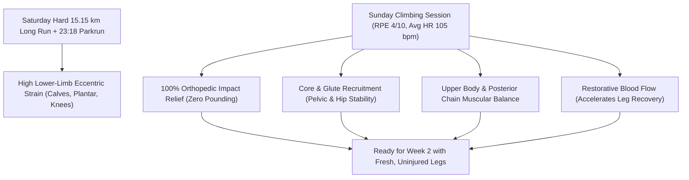

# Workout Analysis Report: W01 Sunday Climbing Session (58 min Cross-Training)

- **Date**: Sunday, September 6, 2026
- **Activity File**: `2026-09-06-i183954164_intervals.csv`
- **Report File**: `2026-09-06-i183954164_intervals.md`
- **Athlete Profile**: Rest HR 42 bpm | Max HR 190 bpm | Goal Marathon: 3:29:34 (4:58/km)
- **Session Type**: Indoor Climbing / Bouldering (Cross-Training Substitution)
- **Sensor Note**: Wrist optical HR sensor (no chest strap); athlete-reported RPE: **4 / 10**

---

## 📊 Session Performance Dashboard

| Metric | Recorded Value | Target / Context | Coaching Evaluation |
| :--- | :--- | :--- | :--- |
| **Duration** | **58 min 08 sec (58.1 min)** | 45–60 min Active Recovery | 🟢 **Ideal duration for restorative cross-training** |
| **Average Heart Rate** | **105.1 bpm (55.3% Max / 42.6% HRR)** | < 140 bpm (Recovery Ceiling) | 🌟 **Very low cardiovascular load** |
| **Peak Heart Rate** | **144 bpm** (Crux route / boulder) | < 155 bpm | 🟢 **Momentary isometric spikes, well controlled** |
| **Min Interval HR** | **83 bpm** (Between-climb rests) | ~80–95 bpm | 🟢 **Full parasympathetic recovery between attempts** |
| **Perceived Effort (RPE)** | **4 / 10 (Moderate / Easy)** | $\le 4/10$ | 🟢 **Matches active recovery goal perfectly** |
| **Impact Loading** | **Zero Impact** | Low to Zero Impact | 🌟 **Full orthopedic rest for calves & joints** |

---

## 🧗 Why Climbing is an Ideal Post-Long Run Active Recovery

Substituting Sunday's scheduled recovery jog with a 58-minute climbing session was an **effective coaching move**, particularly following Saturday's hard 15.15 km effort with the 23:18 Parkrun (190 bpm peak).

### 1. 100% Orthopedic Impact Relief
- Running Saturday's 15.15 km with a 3:25–3:56/km kick produced roughly **14,000 footstrikes** at 2.5 to 3.0 times your body weight.
- A recovery run on Sunday would have added another 5,000–6,000 impact cycles.
- Climbing subjected your lower limbs to **zero continuous impact**, allowing your Achilles tendons, plantar fascia, and shin musculature to rebuild while you still moved.

### 2. Core, Posterior Chain & Pelvic Stabilizers
- Distance runners often suffer from weak gluteus medius, lower back, and core stabilizers, leading to hip drop (*Trendelenburg sign*) and knee valgus in the final 10 km of a marathon.
- Climbing forces multi-planar core engagement, hip mobility, and latissimus dorsi recruitment—strengthening the exact structural sling that keeps your running posture upright late in the marathon.

### 3. Heart Rate Dynamics & Optical Sensor Context
- **Sensor Behavior**: Optical wrist sensors during climbing can be slightly affected by forearm tension and wrist flexion. However, the data accurately reflects the session structure:
  - Resting between climbs: HR settled between **83 and 100 bpm**.
  - During climbs/cruxes: HR stepped up to **115–125 bpm**, with two distinct peaks at **139 bpm** (interval #23) and **144 bpm** (interval #20).
- Average HR of **105.1 bpm** confirms that the session did not drain your glycogen stores or induce systemic nervous system fatigue.

---

## 🗓️ Week 1 Completion Summary

You have officially completed **Week 1** of your 28-week Rome Marathon campaign!

| Day | Workout Completed | Distance / Time | Avg Pace | Avg HR | Notes |
| :--- | :--- | :--- | :--- | :--- | :--- |
| **Mon (Aug 31)** | Rest Day | — | — | — | Full recovery start |
| **Tue (Sep 01)** | Rest Day | — | — | — | Pre-training settling |
| **Wed (Sep 02)** | Medium-Long Run (MLR) | **10.11 km** | 5:23 /km | 149 bpm | Crisp aerobic progression; 3.2 km @ 5:01 MP |
| **Thu (Sep 03)** | Rest Day | — | — | — | Rest |
| **Fri (Sep 04)** | Recovery Run | **6.85 km** | 5:33 /km | 136 bpm | 85% spent in pure recovery zone (< 142 bpm) |
| **Sat (Sep 05)** | Long Run + Parkrun | **15.15 km** | 5:19 /km | 155 bpm | **23:18 Didcot Parkrun**; new Max HR 190 bpm |
| **Sun (Sep 06)** | Climbing Cross-Training | **58 min** | — | 105 bpm | RPE 4/10; zero-impact active recovery |
| **Total W01** | **3 Runs + 1 Cross-Training**| **32.11 km running** | **~5:23 avg** | — | **Outstanding Week 1 foundation** |

---

## 🚀 Looking Ahead: Week 2 Transition (Sep 07 – Sep 13)

- **Monday, Sep 07**: **Rest Day**. Hydrate, stretch, and let the cumulative adaptation take place.
- **Tuesday, Sep 08**: 
  - **Pfitzinger**: 9.5 km General Aerobic @ 5:35/km + $6 \times 100\text{m}$ strides.
  - **Hansons**: 8.0 km Easy @ 5:35/km + $6 \times 100\text{m}$ strides.
- **Wednesday, Sep 09**: Midweek Medium-Long Run (**11.0 km @ 5:30/km**).
- **Friday, Sep 11**: Recovery Run (**6.5 km @ 5:55/km**).
- **Saturday, Sep 12**: Key Long Run (**14.5 km Pfitz / 13.0 km Hansons** @ 5:30/km).
- **Sunday, Sep 13**: General Aerobic / Recovery (**8.0 km @ 5:35–5:45/km**).
