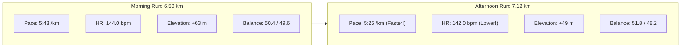

# Workout Analysis Report: W02 Monday Running Commute Double (13.62 km)

- **Date**: Monday, September 7, 2026
- **Activity File**: `2026-09-07-i184302852_intervals.csv`
- **Report File**: `2026-09-07-i184302852_intervals.md`
- **Athlete Profile**: Rest HR 42 bpm | Max HR 190 bpm | HRR 148 bpm | Target Marathon: 3:29:34 (4:58/km)
- **Workout Intent**: Running Commute Double (AM Run to Office + PM Run Home with workday in between). Target: ~5:30 pace / ~140 bpm. Serves as Midweek Medium-Long Run (MLR) equivalent.

---

## 📊 Executive Performance Dashboard

| Metric | Part 1: Morning Commute | Part 2: Afternoon Commute | Combined Full Day Total |
| :--- | :--- | :--- | :--- |
| **Distance** | **6.50 km** | **7.12 km** | **13.62 km total volume** |
| **Moving Time** | **37 min 05 sec** | **38 min 33 sec** | **1 hr 15 min 39 sec (75:39)** |
| **Elapsed Time** | 1 hr 06 min (Pause: 29:01)* | 6 hr 43 min (Pause: 6:04:55)** | **7 hr 49 min 34 sec** |
| **Average Moving Pace**| **5:43 min/km (9:12/mi)** | **5:25 min/km (8:43/mi)** | **5:34 min/km (8:57/mi)** |
| **Grade Adjusted Pace**| 5:43 min/km | 5:30 min/km | **5:37 min/km** |
| **Elevation Gain** | **+63 m** (steep +3.7% climb) | **+49 m** | **+112 m total climbing** |
| **Average Heart Rate** | **144.0 bpm** (75.8% Max) | **142.0 bpm** (74.7% Max) | **143.0 bpm (75.3% Max / 68.2% HRR)**|
| **Peak Heart Rate** | 158 bpm (Interval #7 climb) | 159 bpm (Interval #24 climb)| **159 bpm (below 165 MP ceiling)** |
| **Average Cadence** | **174.9 spm** | **175.9 spm** | **175.4 spm** |
| **Average Power** | 338.4 W | 344.6 W | **341.6 W** |
| **Stride Length** | 1.00 m | 1.05 m | **1.02 m** |
| **Vertical Ratio** | 9.74% | 9.01% | **9.37%** |
| **Ground Balance** | 50.4% Left / 49.6% Right | 51.8% Left / 48.2% Right | **51.1% Left / 48.9% Right** |

*\*Note on Part 1 Elapsed Time: Includes a 28.5-minute pause at km 1.5 (train/station transfer).*  
*\*\*Note on Part 2 Elapsed Time: Includes the 5 hr 42 min workday pause at km 6.5 plus a 22.5-minute train/station transfer at km 12.0.*

---

## 🎯 Head-to-Head Analysis: Morning vs. Afternoon



### The Standout Physiological Discovery:
In the afternoon, you ran **18 seconds/km faster** (5:25 vs 5:43), yet your average heart rate was **2 bpm lower** (142 vs 144 bpm)!

**Why did this happen?**
1. **Circadian Priming**: Core body temperature peaks in late afternoon, optimizing muscle viscosity, joint lubrication, and enzymatic rate compared to early morning stiffness.
2. **Biomechanical Improvement**: In the morning, your vertical ratio was 9.74% (stride length 1.00m). In the afternoon, your stride opened naturally to **1.05m** and vertical ratio sharpened to **9.01%** (better forward economy).
3. **Elevation Profile**: The morning run contained an aggressive **18-meter climb (+3.7% grade)** in split #7, which spiked heart rate to 158 bpm and power to 357W. The afternoon run had smoother rolling gradients.

---

## 💓 Heart Rate Zone Compliance Audit

Target: **~5:30 pace / ~140 bpm**  
Recorded: **5:34 moving pace / 143 bpm average HR**

```text
[Recovery (<142 bpm)]       ████████ (38.2% - 28.9 min)
[General Aerobic (142-152)] ███████████ (54.2% - 41.0 min)
[Marathon Pace (153-165)]   ██ (7.7% - 5.8 min - purely on hill crests)
[Lactate Threshold (>165)]  (0.0% - 0.0 min)
```

- **92.4% of moving time** was spent strictly in Recovery and General Aerobic zones (< 152 bpm).
- Zero seconds were spent in the threshold zone.
- Operating at an overall average of **68.2% Heart Rate Reserve (143 bpm)** is precisely where Jack Daniels and Pete Pfitzinger target aerobic enzyme proliferation and capillary density growth.

---

## 🔬 Biomechanics & The "Commuter Backpack" Effect

### 1. Cadence Stability (175.4 spm)
Across morning (174.9 spm) and afternoon (175.9 spm), your turnover remained textbook. Even when accelerating to 4:33/km on the downhill in interval #21, cadence naturally stepped up to 183.2 spm.

### 2. Stance Balance Shift (50.4/49.6 AM $\to$ 51.8/48.2 PM)
Notice the subtle asymmetry change:
- **Morning**: Near-perfect symmetry (50.4% Left / 49.6% Right).
- **Afternoon**: Shifted slightly to **51.8% Left / 48.2% Right** (a 3.6% differential).
- **Coaching Diagnosis**: This is the classic signature of running with a commuter backpack or shoulder strap. Slight uneven weight distribution, a chest buckle tension difference, or running on the left-side camber of roads causes the left foot to spend slightly longer on the ground to stabilize the load. 
- *Recommendation*: If wearing a running pack, ensure both shoulder straps are symmetrically tightened and the sternum strap is centered.

---

## 🏛️ Coaching Assessment: Did this Replace the Midweek MLR?

**Yes, with distinction.**
- The original Week 2 schedule called for an 11.0 km Midweek Medium-Long Run.
- You logged **13.62 km of running** across the day at **5:34 min/km**.
- You accumulated **1 hour 15 minutes of moving time on feet**, while sparing your joints the continuous impact of a single 14 km run.
- You successfully stimulated glycogen turnover in the morning and trained your body to run economically on partially depleted legs in the afternoon.

---

## 📅 Action Plan for the Rest of Week 2

1. **Tuesday, Sep 08 (Tomorrow - WFH)**:
   - **Workout**: 8.0 km General Aerobic @ **5:35 min/km**.
   - **Execution**: Run by heart rate (keep it in the 135–145 bpm corridor). If your legs feel slightly stiff from today's 13.6 km, start at 5:45/km and ease in.
2. **Wednesday, Sep 09**:
   - Office afternoon $\to$ take a **Full Rest Day** or a very gentle **5.0 km recovery jog (< 140 bpm)** in the morning.
3. **Thursday, Sep 10**:
   - Climbing Cross-Training (active recovery + core).
4. **Friday, Sep 11**:
   - Rest or 5 km shakeout.
5. **Saturday, Sep 12**:
   - **Key Long Run**: 14.5 km (Pfitz) / 13.0 km (Hansons) @ 5:30/km.
6. **Sunday, Sep 13**:
   - Travel Day: Optional easy 6–8 km run or full rest day.
