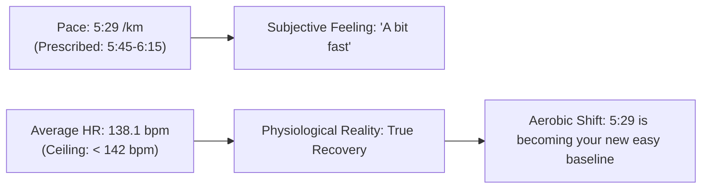

# Workout Analysis Report: W02 Friday Recovery Run (5.96 km)

- **Date**: Friday, September 11, 2026
- **Activity File**: `2026-09-11-i185573972_intervals.csv`
- **Report File**: `2026-09-11-i185573972_intervals.md`
- **Athlete Profile**: Rest HR 42 bpm | Max HR 190 bpm | HRR 148 bpm | Target Marathon: 3:29:34 (4:58/km)
- **Target Prescription**: W02 Friday Recovery Run: **5.0 – 6.5 km (< 142 bpm)**
- **Athlete Note**: *"completed recovery run a bit overpaced"*

---

## 📊 Executive Performance Dashboard

| Metric | Recorded Value | Target / Prescribed | Coaching Evaluation |
| :--- | :--- | :--- | :--- |
| **Total Distance** | **5.96 km (5,963 m)** | 5.0 – 6.5 km | 🟢 **Optimal recovery volume** |
| **Moving Time** | **32 min 38 sec** | ~30–35 min | 🟢 **Exact planned duration** |
| **Elapsed Time** | 33 min 26 sec (Pause: 47s) | — | 🟢 Continuous, uninterrupted flow |
| **Average Moving Pace** | **5:29 min/km (8:50/mi)** | 5:45 – 6:15 min/km | 🟡 **Faster than planned pace, but...** |
| **Grade Adjusted Pace (GAP)**| **5:33 min/km** | 5:45 – 6:00 min/km | 🟢 **Controlled effort on rolling terrain** |
| **Average Heart Rate** | **138.1 bpm (72.7% Max / 64.9% HRR)** | **< 142 bpm (Recovery Ceiling)** | 🌟 **Flawless cardiovascular recovery!** |
| **Peak Heart Rate** | **154 bpm** (Uphill km 5.5) | < 155 bpm | 🟢 **Zero threshold or anaerobic strain** |
| **Average Cadence** | **177.8 spm** | 174 – 180 spm | 🌟 **Light, elastic, joint-sparing turnover** |
| **Average Power** | **339.5 W** | < 350 W | 🟢 **Lowest power average of the week** |
| **Ground Contact Balance** | **50.6% Left / 49.4% Right** | 50.0 / 50.0 | 🌟 **Excellent bilateral symmetry** |
| **Vertical Ratio** | **9.17%** | < 9.5% | 🟢 **Clean forward mechanics** |

---

## 🔍 The "Overpaced" Question: Did You Run Too Fast?

> **Athlete Assessment**: *"completed recovery run a bit overpaced"*

### The Coaching Verdict: **Pace was brisk, but your physiology stayed 100% in the Recovery Zone.**

Here is the breakdown of what happened:



1. **The Cardiovascular Reality (< 142 bpm Ceiling)**:
   - Pete Pfitzinger defines a recovery run as strictly **< 76% Max HR / < 70% HRR (< 142 bpm)**.
   - Your moving average heart rate was **138.1 bpm** (64.9% HRR).
   - **71.1% of your run (23.2 minutes)** was spent strictly below 142 bpm.
   - The only segments that nudged into 143–150 bpm were the uphill inclines (the opening +3.9% climb and the +1.5% grade at km 5.5).
   - **Zero seconds were spent in Marathon Pace or Threshold territory.**
2. **The "Aerobic Shift" Effect**:
   - Why did you run 5:29/km without your heart rate climbing?
   - As your aerobic base deepens and your **diaphragmatic breathing** takes hold, your "default cruising speed" naturally drifts faster for the same internal cardiac cost. 
   - Two weeks ago, 5:30 pace required 149 bpm; today, 5:29 required only **138 bpm**.
3. **The Orthopedic Caveat**:
   - While your heart and lungs were in a recovery zone, running at 5:29/km creates marginally higher ground-reaction impact forces than 5:55/km. 
   - Because you kept the run short (**32 minutes / 5.96 km**), the impact load was low, and your legs will be completely fine for Saturday's long run.
   - *Coaching takeaway for future recovery runs*: If you ever feel heavy in the legs, actively force yourself to run 5:50–6:00/km to give the musculoskeletal system a true break, even if your cardiovascular system feels like it wants to cruise at 5:29.

---

## 📈 Pace & Heart Rate Progression (250m Splits)

- **Km 0.0 – 1.0 (Uphill Settling)**: 
  - Opening 250m had a steep **+3.9% grade (+9m gain)** taken at 5:56/km (HR 113 bpm). 
  - Rest of the kilometer settled through 5:38 $\to$ 5:29 $\to$ 5:36 (HR 131–137 bpm).
- **Km 1.0 – 4.0 (The Groove)**:
  - Very tight pacing cluster: **5:21 – 5:31 min/km**.
  - Heart rate remained clamped between **133 and 140 bpm**.
  - Stride was compact (1.02–1.05m) and cadence was brisk (**178 spm**).
- **Km 4.0 – 5.5 (Gentle Rollers)**:
  - Pace held at 5:15–5:26/km, with HR rising slightly to 142–148 bpm on rolling rises.
- **Km 5.5 – 5.96 (Controlled Finish)**:
  - Controlled finish at 5:45/km uphill, peaking at 154 bpm.

---

## 💓 Heart Rate Zone Compliance Breakdown

```text
[Recovery (<142 bpm)]       ██████████████ (71.1% - 23.2 min)
[General Aerobic (142-152)] ██████ (28.9% - 9.4 min)
[Marathon Pace (>152 bpm)]  (0.0% - 0.0 min)
[Lactate Threshold (>165)]  (0.0% - 0.0 min)
```

- **Clean Recovery Profile**: Over 70% in Zone 1 recovery, with remaining time in low Zone 2 on hills.
- **Bilateral Symmetry**: **50.6% Left / 49.4% Right** (near-perfect balance, zero limping or compensation).

---

## 🚀 Status for the Weekend

You are in a great position heading into the weekend:
- **Monday**: 13.62 km Commute Double (143 bpm)
- **Tuesday**: 10.06 km GA + 6 Strides (141 bpm)
- **Thursday**: Climbing Cross-Training (Core & active mobility)
- **Friday**: 5.96 km Recovery Run (138 bpm)
- **Total So Far**: **29.64 km running + 1 climbing session**

### Saturday Key Long Run Target:
- **Prescription**: **14.5 km (Pfitz) / 13.0 km (Hansons)**
- **Pacing Strategy**: Start easy around **5:40 – 5:45 min/km** for the first 3 km, settle into **5:25 – 5:30 min/km**, and let the last 2–3 km progress down toward **5:15 min/km** if feeling strong.
- **Hydration**: Practice taking sips of water or an energy gel around km 8–10 to keep training your gut for Rome!
