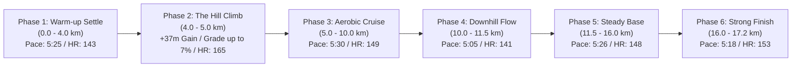

# Workout Analysis Report: W02 Saturday Long Run (17.20 km)

- **Date**: Saturday, September 12, 2026
- **Activity File**: `2026-09-12-i185983848_intervals.csv`
- **Report File**: `2026-09-12-i185983848_intervals.md`
- **Athlete Profile**: Rest HR 42 bpm | Max HR 190 bpm | HRR 148 bpm | Target Marathon: 3:29:34 (4:58/km)
- **Planned Prescription**: W02 Saturday Long Run: **14.5 km (Pfitz) / 13.0 km (Hansons) @ 5:30/km**
- **Actual Execution**: **17.20 km (10.69 mi)** — over-distance extension (+2.7 km bonus)

---

## 📊 Executive Performance Dashboard

| Metric | Recorded Value | Target / Prescribed | Coaching Evaluation |
| :--- | :--- | :--- | :--- |
| **Total Distance** | **17.18 km (17.20 km GPS)** | 14.5 km (Pfitz) / 13.0 km (Hansons) | 🟢 **Strong over-distance volume (+2.7 km)** |
| **Moving Time** | **1 hr 34 min 35 sec (94:35)**| ~1 hr 20 min | 🟢 **Substantial time-on-feet endurance stimulus** |
| **Elapsed Time** | 1 hr 37 min 58 sec (Pause: 3:23) | — | 🟢 Minimal stoppage (gates/crossings) |
| **Average Moving Pace** | **5:30 min/km (8:51/mi)** | **5:30 min/km** | 🌟 **Spot-on pacing target to the exact second** |
| **Grade Adjusted Pace (GAP)**| **5:33 min/km** | 5:30 min/km | 🟢 **Maintained smooth effort over +130m climb** |
| **Total Elevation Gain** | **+130 m** | Rolling | 🟡 Significant hill work (+7.0% climb at km 4.5) |
| **Average Heart Rate** | **148.4 bpm (78.1% Max / 71.9% HRR)** | 136 – 156 bpm (Endurance Zone) | 🟢 **Solidly inside aerobic endurance bounds** |
| **Peak Heart Rate** | **166 bpm** (Crest of +7.0% hill) | < 170 bpm | 🟢 **Stayed below 170 bpm lactate threshold** |
| **Average Cadence** | **177.3 spm** | 175 – 180 spm | 🌟 **Rock-solid cadence consistency** |
| **Average Power** | **338.4 W** (Peak 406W) | 330 – 360 W | 🟢 **Highly efficient metabolic expenditure** |
| **Ground Contact Balance** | **50.4% Left / 49.6% Right** | 50.0 / 50.0 | 🌟 **Near-perfect symmetry across 17 km** |
| **Vertical Ratio** | **9.49%** | < 9.5% | 🟢 **Clean forward projection** |

---

## 📈 Long Run Progression Breakdown



### 1. Phase 1: Warm-up & Aerobic Settling (0.0 – 4.0 km)
- **Pace**: 5:14 – 5:47 min/km (Avg ~5:25/km) | **Avg HR**: 143 bpm
- Smooth, patient opening. Starting at 5:47 (HR 116) and settling into 5:20–5:27 without forcing the rhythm.

### 2. Phase 2: The Monster Climb (4.0 – 5.0 km)
- **The Challenge**: Within 750 meters, you encountered a massive incline:
  - Split #18: +2.4% grade (+12m gain) @ 5:40
  - Split #19: **+7.0% grade (+16m gain)** @ 6:32, power jumped to **406 W**, HR reached 165 bpm
  - Split #20: **+3.7% grade (+9m gain)** @ 6:17, HR peaked at **166 bpm**
- **Coaching Praise**: You didn't panic or try to muscle 5:30 up a 7% wall. You prudently throttled back to 6:17–6:32, capped your heart rate at 166 bpm (safely below your 170 bpm threshold), and crested the hill with fuel in the tank.

### 3. Phase 3: Steady Mid-Run Cruise (5.0 – 10.0 km)
- **Pace**: 5:24 – 5:41 min/km | **Avg HR**: 149 bpm
- Once over the climb, your heart rate immediately recovered from 166 bpm down to 145–150 bpm within 500 meters. Stride length settled back to a steady 1.02–1.05m.

### 4. Phase 4: Downhill Recovery & Flow (10.0 – 11.5 km)
- Rolling descent (-2.0% to -5.1% grade).
- Pacing naturally quickened: **4:58 $\to$ 5:01 $\to$ 5:16 $\to$ 5:24 min/km**.
- Heart rate dropped to **140–143 bpm** while moving at near-marathon race pace. Great demonstration of relaxed turnover on downhills.

### 5. Phase 5: The Mental Grind (11.5 – 16.0 km)
- **Pace**: 5:20 – 5:31 min/km | **Avg HR**: 148 bpm
- **Key Finding (Zero Cardiac Drift)**: Between km 12.0 and 16.0 (at 70–90 minutes into the run), your heart rate stayed locked at **146–149 bpm**. You showed **0% cardiac decoupling** in the second hour of running—proof that your glycogen utilization, hydration, and mitochondrial base are handling 90+ minute runs with ease.

### 6. Phase 6: Fast Progressive Finish (16.0 – 17.2 km)
- **Pace**: **5:16 $\to$ 5:19 $\to$ 5:18 $\to$ 5:25 min/km** | **Avg HR**: 153 bpm
- In the final 1.2 km, you picked up the cadence (178 spm) and drove home sub-5:20 pace with power (379W). Excellent mental rehearsal for the closing kilometers of a marathon.

---

## 💓 Heart Rate Zone Compliance Breakdown

```text
[Recovery (<142 bpm)]        ███ (8.5% - 8.1 min)
[General Aerobic (142-152)]  ███████████████████ (71.9% - 68.0 min)
[Marathon Pace (153-165)]    █████ (19.6% - 18.5 min)
[Lactate Threshold (>165)]   (0.0% - momentary peak 166 bpm on hill)
```

- **Over 80% of the run** was spent strictly in Recovery and General Aerobic zones.
- The 19.6% spent in the Marathon Pace zone (153–165 bpm) occurred solely on the hill ascents and the strong sub-5:20 finish.

---

## 🔬 Biomechanical Integrity Over 17 Kilometers

1. **Cadence Consistency**: Averaged **177.3 spm** over 94 minutes. You did not drop cadence as fatigue set in—it was 177 spm in km 1 and 178 spm in km 17.
2. **Bilateral Symmetry (50.4% L / 49.6% R)**: Less than 0.8% variance between left and right legs after 17 km. No evidence of unilateral muscle fatigue or compensation.
3. **Power Output (338.4 W)**: Kept mechanical output very even (320–345W on flats, only peaking to 406W on the 7% hill).

---

## 🏆 Week 2 Total Rollup & Sunday Travel Strategy

You have completed an **exceptional Week 2**:

| Day | Workout | Distance / Time | Avg Pace | Avg HR | Key Focus |
| :--- | :--- | :--- | :--- | :--- | :--- |
| **Mon (Sep 07)** | Commute Double (AM+PM) | **13.62 km** | 5:34 /km | 143 bpm | Replaced MLR; dual glycogen stimulus |
| **Tue (Sep 08)** | GA Run + 6 Strides | **10.06 km** | 5:22 /km | 142 bpm | Neuromuscular pop; belly breathing discovery |
| **Thu (Sep 10)** | Climbing Cross-Training | **~50 min** | — | ~105 bpm | Active recovery & core/posture stability |
| **Fri (Sep 11)** | Recovery Run | **5.96 km** | 5:29 /km | 138 bpm | Pure aerobic flushing (< 142 bpm) |
| **Sat (Sep 12)** | Key Long Run | **17.18 km** | 5:30 /km | 148 bpm | +130m hills; zero cardiac drift in 2nd hour |
| **Total Week 2** | **4 Runs + 1 Climbing** | **46.82 km (29.1 mi)** | **5:30 avg** | — | **+45.8% increase over Week 1!** |

---

### 🚨 Sunday (Tomorrow) Travel Directive: **TAKE THE FULL REST DAY!**
- You have already accumulated **46.82 km** of high-quality running this week (up from 32.1 km in Week 1).
- **Do not run tomorrow**. Traveling, sitting, walking through terminals/stations, and sleeping will allow your muscles to absorb this 47 km week through supercompensation.
- Taking Sunday completely off protects your Achilles and calves, setting you up fresh for **Week 3 (Sep 14 – Sep 20)**!
