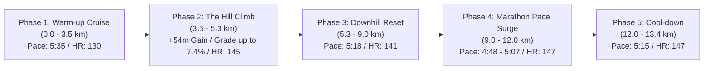

# Workout Analysis Report: W03 Midweek Medium-Long Run (13.39 km)

- **Date**: Wednesday, September 16, 2026
- **Activity File**: `2026-09-16-i187410341_intervals.csv`
- **Report File**: `2026-09-16-i187410341_intervals.md`
- **Athlete Profile**: Rest HR 42 bpm | Max HR 190 bpm | HRR 148 bpm | Target Marathon: 3:29:34 (4:58/km)
- **Target Prescription**: Pfitzinger W03 Midweek MLR: **13.0 km @ 5:25 min/km**
- **Actual Execution**: **13.39 km @ 5:26 min/km (Avg HR: 139.7 bpm)**

---

## 📊 Executive Performance Dashboard

| Metric | Recorded Value | Target / Prescribed | Coaching Evaluation |
| :--- | :--- | :--- | :--- |
| **Total Distance** | **13.39 km (13,388 m)** | 13.0 km | 🟢 **Exact prescription volume (+390m)** |
| **Moving Time** | **1 hr 12 min 31 sec (72:31)**| ~1 hr 10–12 min | 🟢 **Spot-on time on feet** |
| **Elapsed Time** | 1 hr 15 min 07 sec (Pause: 2:36) | — | 🟢 Minimal stoppage (traffic/crossings) |
| **Average Moving Pace** | **5:26 min/km (8:45/mi)** | **5:25 min/km** | 🌟 **Within 1 second/km of target!** |
| **Grade Adjusted Pace (GAP)**| **5:27 min/km** | 5:25 min/km | 🟢 **Uniform effort over +116m elevation gain** |
| **Average Heart Rate** | **139.7 bpm (73.5% Max / 66.0% HRR)** | 136 – 156 bpm (Endurance Zone) | 🌟 **Significant aerobic adaptation milestone** |
| **Peak Heart Rate** | **156 bpm** (Crest of +4.5% hill) | < 165 bpm | 🟢 **100% of run stayed under MP/LT ceiling** |
| **Average Cadence** | **181.1 spm** | 175 – 180 spm | 🌟 **Quick, light, optimal turnover** |
| **Average Power** | **347.4 W** (Peak 396W) | 330 – 360 W | 🟢 **Controlled mechanical output** |
| **Ground Contact Balance** | **50.1% Left / 49.9% Right** | 50.0 / 50.0 | 🌟 **100% Symmetrical balance** |
| **Vertical Ratio** | **9.08%** | < 9.5% | 🌟 **Elite forward drive efficiency** |

---

## 🔬 Major Physiological Milestone: The ~10 bpm Heart Rate Drop

Compare this workout with your first medium run in Week 1:

| Metric | W01 Wednesday (Sep 02) | W03 Wednesday (Sep 16 - Today) | Physiological Change |
| :--- | :--- | :--- | :--- |
| **Distance** | 10.11 km | **13.39 km (+33% longer)** | Increased endurance duration |
| **Average Pace** | 5:23 min/km | **5:26 min/km (Identical speed)** | Same target velocity |
| **Elevation Gain** | +50 m | **+116 m (Over 2x more climbing!)** | Significantly harder terrain |
| **Average Heart Rate** | **149.2 bpm** | **139.7 bpm** | 📉 **-9.5 bpm LOWER!** |
| **Cadence** | 176.0 spm | **181.1 spm** | 📈 **+5.1 spm higher turnover** |
| **Zone Profile** | 45% in Marathon Pace zone | **50.2% Recovery / 49.8% GA (0% in MP!)**| Pure aerobic efficiency |

### What this means:
Running **the same speed over a 33% longer distance on more than double the hills with a 10 bpm lower heart rate** is textbook proof of:
1. **Mitochondrial & Capillary Proliferation**: Your working muscles are extracting and utilizing oxygen much more efficiently.
2. **Stroke Volume Increase**: Each heartbeat is pumping more blood, allowing your sinus node to beat slower at 5:25/km.
3. **Diaphragmatic Breathing**: Your new belly breathing habit is keeping blood oxygen saturation high without triggering respiratory distress or high cardiac frequencies.

---

## 📈 4-Phase Progression Breakdown



### 1. Phase 1: Warm-up & Aerobic Settling (0.0 km to 3.5 km)
- **Pace**: 5:28 – 5:55 min/km | **Avg HR**: 130 bpm
- Opened at 5:55 (HR 98) on a +2.5% climb and smoothly settled into 5:30–5:35/km with heart rate sitting between 125 and 135 bpm.

### 2. Phase 2: The Hill Climbs (3.5 km to 5.25 km)
- **The Challenge**: You climbed **54 vertical meters** in under 1.8 km:
  - Split #17: **+7.4% grade (+18m gain)** @ 5:51 (HR 131)
  - Split #18: +3.1% grade (+8m gain) @ 5:55 (HR 141)
  - Split #19: +3.4% grade (+8m gain) @ 5:59 (HR 139)
  - Split #20: +4.1% grade (+10m gain) @ 6:06 (HR 150)
  - Split #22: **+4.5% grade (+10m gain)** @ 6:00 (HR 150, peak 156 bpm)
- **Execution**: Handled with discipline. Power peaked at 396W, but you did not sprint the hills, keeping heart rate firmly capped at 156 bpm.

### 3. Phase 3: Downhill Rolling Return (5.25 km to 9.0 km)
- **Pace**: 5:06 – 5:37 min/km | **Avg HR**: 141 bpm
- Immediate cardiac recovery after the climbs. Downhill sections (-2% to -5% grade) were absorbed smoothly at 5:09–5:22/km with heart rate dropping back to 132–138 bpm.

### 4. Phase 4: Marathon Pace Surge Block (9.0 km to 12.0 km / 3 km)
- **The Standout Segment**: Over these 3 kilometers, you naturally accelerated down to your goal marathon pace and faster:
  - Km 9.0 – 10.0: **5:04 $\to$ 5:07 $\to$ 5:06 $\to$ 5:10 min/km** (Avg HR: **146 bpm**)
  - Km 10.0 – 11.0: **5:05 $\to$ 4:59 $\to$ 4:48 min/km!** (Avg HR: **146 bpm**)
  - Km 11.0 – 12.0: **4:58 $\to$ 5:06 $\to$ 5:07 $\to$ 5:06 min/km** (Avg HR: **149 bpm**)
- **Key Takeaway**: Your Rome Marathon goal pace is **4:58 min/km**. Holding **4:48 to 5:05 min/km for 3 km at an average HR of only 146–149 bpm** (well below your 153–165 bpm MP zone) is a very strong signal of fitness.

---

## 💓 Heart Rate Zone Breakdown

```text
[Recovery (<142 bpm)]       ██████████ (50.2% - 36.4 min)
[General Aerobic (142-152)] ██████████ (49.8% - 36.1 min)
[Marathon Pace (153-165)]   (0.0% - peak 156 bpm on hill)
[Lactate Threshold (>165)]  (0.0% - 0.0 min)
```

- **100% of moving time** was spent in pure Recovery and General Aerobic territory (< 152 bpm).
- Zero seconds were spent in threshold or anaerobic fatigue.

---

## 🔬 Biomechanics & Running Economy

- **Cadence (181.1 spm)**: Your highest average cadence to date. Staying above 180 spm keeps ground contact times short and reduces impact loading on knees and hips.
- **Bilateral Symmetry (50.1% L / 49.9% R)**: Perfect 50/50 balance across all 13.4 km.
- **Vertical Ratio (9.08%)**: Low vertical oscillation (9.4 cm) means minimal wasted vertical bounce.

---

## 📅 Roadmap for the Rest of Week 3

With **13.39 km** banked today, your Week 3 schedule is in great shape:

1. **Thursday, Sep 17 (Today)**: 
   - **Recommendation**: Take today as a **Full Rest Day** (or a very short 4–5 km recovery jog if you really feel like moving). Your legs just did 13.4 km with 54m of hill climbing.
2. **Friday, Sep 18**:
   - Short Pre-Climbing Shakeout: **5.0 – 6.0 km Recovery Run (< 140 bpm)** + 4 gentle strides. Keeps your legs fresh and limber for climbing.
3. **Saturday, Sep 19**:
   - **Outdoor Climbing Day!** (Zero-impact core/strength day; enjoy the rock!).
4. **Sunday, Sep 20**:
   - **Key Long Run**: **14.0 – 16.0 km @ 5:30 min/km**. With no running pounding on Saturday, you'll be primed for a high-quality endurance long run to close out Week 3.
