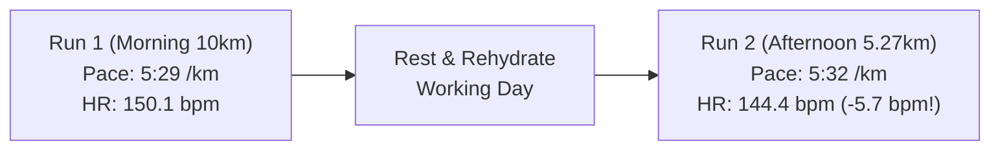

# Workout Analysis Report: W04 Thursday Run 2 (5.27 km - Afternoon Shakeout)

- **Date**: Thursday, September 24, 2026 (Run 2 of Double)
- **Activity File**: `2026-09-24-2-i189997786_intervals.csv`
- **Report File**: `2026-09-24-2-i189997786_intervals.md`
- **Athlete Profile**: Rest HR 42 bpm | Max HR 190 bpm | HRR 148 bpm | Target Marathon: 3:29:34 (4:58/km)
- **Context**: Second session of the Thursday return double (following the 10km morning run).

---

## 📊 Executive Performance Dashboard

| Metric | Recorded Value | Target / Prescribed | Coaching Evaluation |
| :--- | :--- | :--- | :--- |
| **Total Distance** | **5.27 km (5,272 m)** | ~5.0 km Shakeout | 🟢 **Optimal second-run volume** |
| **Moving Time** | **29 min 08 sec** | ~28–30 min | 🟢 **Controlled duration** |
| **Elapsed Time** | 29 min 12 sec (Pause: 4s) | — | 🟢 Continuous, steady flow |
| **Average Moving Pace** | **5:32 min/km (8:54/mi)** | 5:35 – 5:50 min/km | 🟢 **Relaxed aerobic cruising** |
| **Grade Adjusted Pace (GAP)**| **5:34 min/km** | 5:35 min/km | 🟢 **Steady effort over +28m elevation gain** |
| **Average Heart Rate** | **144.4 bpm (76.0% Max / 69.2% HRR)** | < 148 bpm | 📉 **Down -5.7 bpm vs Run 1!** |
| **Peak Heart Rate** | **160 bpm** (Uphill crest) | < 165 bpm | 🟢 **Safely below 170 bpm threshold** |
| **Average Cadence** | **178.3 spm** | 175 – 180 spm | 🌟 **Light, protective turnover** |
| **Average Power** | **331.9 W** | < 345 W | 🟢 **Low mechanical cost** |
| **Ground Contact Balance** | **50.2% Left / 49.8% Right** | 50.0 / 50.0 | 🌟 **High bilateral symmetry** |
| **Vertical Ratio** | **9.14%** | < 9.5% | 🌟 **Clean forward horizontal drive** |

---

## 🔬 Run 1 vs. Run 2: The Cardiovascular Recovery Shift

### The Key Coaching Insight:
Notice the immediate positive physiological trend:
- In **Run 1**, your average heart rate was **150.1 bpm**.
- In **Run 2**, at virtually the same pace (5:32 vs 5:29/km), your heart rate dropped to **144.4 bpm** (**a 5.7 bpm reduction!**).
- **Zone Shift**: In Run 1, 50% of the run was in Zone 3 (MP). In Run 2, **85.9% of the run was in Zones 1 & 2 (Recovery and GA)**!
- **Why?** The morning 10 km "primed the pump"—it stimulated circulation, cleared bronchial secretions, and re-mobilized fluids. Between runs, you rehydrated, and your autonomic nervous system began calming down, bringing your heart rate back toward your true baseline.

---

## 🏆 Combined Thursday Double Rollup

| Session | Distance | Moving Time | Pace | Avg HR | Cadence | Elevation |
| :--- | :--- | :--- | :--- | :--- | :--- | :--- |
| **Run 1 (Morning)** | 10.00 km | 54:47 | 5:29 /km | 150.1 bpm | 179.0 spm | +37 m |
| **Run 2 (Afternoon)** | 5.27 km | 29:08 | 5:32 /km | 144.4 bpm | 178.3 spm | +28 m |
| **Combined Total** | **15.27 km (9.5 mi)** | **1 hr 23 min 55 sec** | **5:30 /km** | **148.1 bpm** | **178.8 spm** | **+65 m** |

Logging **15.27 km total** in a single day right after recovering from the flu is an impressive aerobic return!
