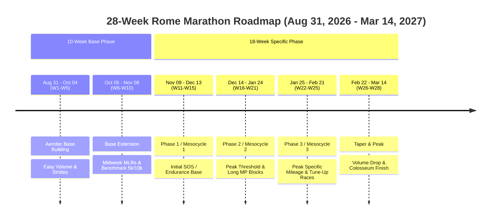

# Rome Marathon (March 14, 2027) 28-Week Master Training Plans

**Target Race**: Acea Run Rome The Marathon  
**Race Date**: Sunday, March 14, 2027  
**Training Start Date**: Monday, August 31, 2026  
**Total Preparation Runway**: Exactly 28 Weeks (196 Days)  

---

## 🏛️ Course Profile: Rome Marathon Nuances
The Rome Marathon (*Maratona di Roma*) starts and finishes by the historic Colosseum (*Via dei Fori Imperiali*). Key course characteristics to prepare for in your training:
1. **Cobblestones (*Sanpietrini*)**: Approximately 6–7 km of the course (mostly in the historic center and final kilometers) feature cobblestones. Both plans incorporate leg turnover strides and soft-tissue conditioning to prepare your feet, calves, and ankles.
2. **Rolling Elevation**: While mostly flat along the Tiber river, there are gentle undulations and bridges around km 28–35.
3. **Pacing Discipline**: The festive atmosphere near the Vatican and Spanish Steps tempts runners to surge early.

---

## 🗓️ 28-Week Master Timeline Architecture

---

# Plan 1: Pete Pfitzinger 28-Week Master Marathon Plan

*Philosophy: Lactate Threshold focus, midweek Medium-Long Runs (MLRs), and progressive long runs reaching 20–21 miles.*

### Pacing Zones (Adjust based on your 5k/10k baseline)
- **Recovery (Rec)**: 60–90s/mi (+37–56s/km) slower than Marathon Pace (MP) | $< 76\%$ Max HR
- **General Aerobic (GA)**: 45–75s/mi (+28–47s/km) slower than MP | $70\% - 81\%$ Max HR
- **Endurance (MLR / Long)**: Start +20% slower than MP, progress to +10% slower | $73\% - 84\%$ Max HR
- **Marathon Pace (MP)**: Exact target marathon race pace | $82\% - 88\%$ Max HR
- **Lactate Threshold (LT)**: 15k to Half Marathon race pace | $85\% - 91\%$ Max HR
- **VO2max**: 3k to 5k race pace ($600\text{m} - 1200\text{m}$ repeats) | $93\% - 98\%$ Max HR

---

### Phase 1: 10-Week Pfitzinger Base Building (Aug 31 – Nov 08, 2026)

| Week | Dates | Mon | Tue | Wed (Midweek MLR) | Thu | Fri | Sat | Sun (Long Run) | Weekly Vol |
| :---: | :---: | :---: | :---: | :---: | :---: | :---: | :---: | :---: | :---: |
| **W01** | Aug 31 - Sep 06 | Rest | 5 mi (8 km) GA | 7 mi (11 km) GA | Rest | 4 mi (6.5 km) Rec | 4 mi (6.5 km) GA + 6 Strides | 8 mi (13 km) Long | 28 mi (45 km) |
| **W02** | Sep 07 - Sep 13 | Rest | 6 mi (9.5 km) GA | 7 mi (11 km) GA | Rest | 4 mi (6.5 km) Rec | 5 mi (8 km) GA + 6 Strides | 9 mi (14.5 km) Long | 31 mi (50 km) |
| **W03** | Sep 14 - Sep 20 | Rest | 6 mi (9.5 km) GA | 8 mi (13 km) MLR | Rest | 4 mi (6.5 km) Rec | 5 mi (8 km) GA + 6 Strides | 10 mi (16 km) Long | 33 mi (53 km) |
| **W04** | Sep 21 - Sep 27 | Rest | 7 mi (11 km) GA | 8 mi (13 km) MLR | Rest | 4 mi (6.5 km) Rec | 6 mi (9.5 km) GA + 6 Strides | 11 mi (17.5 km) Long| 36 mi (58 km) |
| **W05** | Sep 28 - Oct 04 | Rest | 5 mi (8 km) GA | 7 mi (11 km) GA | Rest | 4 mi (6.5 km) Rec | 4 mi (6.5 km) Rec | 8 mi (13 km) Rec Long | 28 mi (45 km) *(Down)* |
| **W06** | Oct 05 - Oct 11 | Rest | 7 mi (11 km) GA | 9 mi (14.5 km) MLR | Rest | 5 mi (8 km) Rec | 6 mi (9.5 km) GA + 6 Strides | 12 mi (19 km) Long | 39 mi (63 km) |
| **W07** | Oct 12 - Oct 18 | Rest | 7 mi (11 km) GA | 10 mi (16 km) MLR | Rest | 5 mi (8 km) Rec | 6 mi (9.5 km) GA + 6 Strides | 13 mi (21 km) Long | 41 mi (66 km) |
| **W08** | Oct 19 - Oct 25 | Rest | 8 mi (13 km) GA | 10 mi (16 km) MLR | Rest | 5 mi (8 km) Rec | 7 mi (11 km) GA + 6 Strides | 14 mi (22.5 km) Long| 44 mi (71 km) |
| **W09** | Oct 26 - Nov 01 | Rest | 8 mi (13 km) GA (w/ 3 mi @ LT)| 11 mi (17.5 km) MLR | Rest | 5 mi (8 km) Rec | 6 mi (9.5 km) GA + 6 Strides | 14 mi (22.5 km) Long| 44 mi (71 km) |
| **W10** | Nov 02 - Nov 08 | Rest | 6 mi (9.5 km) GA | 8 mi (13 km) MLR | Rest | 4 mi (6.5 km) Rec | **5k/10k Time Trial (7 mi total)** | 10 mi (16 km) Long | 35 mi (56 km) *(Test)* |

---

### Phase 2: 18-Week Specific Pfitzinger Marathon Plan (Nov 09, 2026 – Mar 14, 2027)

| Week | Dates | Meso | Mon | Tue | Wed (Key MLR) | Thu | Fri | Sat | Sun (Long Run) | Weekly Vol |
| :---: | :---: | :---: | :---: | :---: | :---: | :---: | :---: | :---: | :---: | :---: |
| **W11 (18)** | Nov 09 - Nov 15 | Endur | Rest | 8 mi (13k) GA + Strides | 11 mi (17.5k) MLR | Rest | 5 mi (8k) Rec | 9 mi (14.5k) GA | 15 mi (24k) Long | 48 mi (77 km) |
| **W12 (17)** | Nov 16 - Nov 22 | Endur | Rest | 9 mi w/ **4 mi @ LT** | 11 mi (17.5k) MLR | Rest | 5 mi (8k) Rec | 9 mi (14.5k) GA | 16 mi w/ **8 mi @ MP** | 50 mi (80 km) |
| **W13 (16)** | Nov 23 - Nov 29 | Endur | Rest | 9 mi (14.5k) GA + Strides | 12 mi (19k) MLR | Rest | 5 mi (8k) Rec | 10 mi (16k) GA | 17 mi (27k) Long | 53 mi (85 km) |
| **W14 (15)** | Nov 30 - Dec 06 | Endur | Rest | 10 mi w/ **5 mi @ LT** | 12 mi (19k) MLR | Rest | 5 mi (8k) Rec | 10 mi (16k) GA | 18 mi w/ **10 mi @ MP** | 55 mi (88 km) |
| **W15 (14)** | Dec 07 - Dec 13 | Endur | Rest | 10 mi (16k) GA + Strides| 13 mi (21k) MLR | Rest | 5 mi (8k) Rec | 10 mi (16k) GA | 19 mi (30.5k) Long | 57 mi (92 km) |
| **W16 (13)** | Dec 14 - Dec 20 | Endur | Rest | 8 mi (13k) GA + Strides | 10 mi (16k) MLR | Rest | 4 mi (6.5k) Rec| 8 mi (13k) GA | 14 mi (22.5k) Long | 44 mi (71 km) *(Down)*|
| **W17 (12)** | Dec 21 - Dec 27 | LT/End| Rest | 10 mi w/ **5 mi @ LT** | 13 mi (21k) MLR | Rest | 6 mi (9.5k) Rec| 10 mi (16k) GA | 20 mi w/ **12 mi @ MP** | 59 mi (95 km) |
| **W18 (11)** | Dec 28 - Jan 03 | LT/End| Rest | 11 mi (17.5k) GA + Str | 14 mi (22.5k) MLR | Rest | 6 mi (9.5k) Rec| 11 mi (17.5k) GA | 20 mi (32k) Long | 62 mi (100 km)|
| **W19 (10)** | Jan 04 - Jan 10 | LT/End| Rest | 11 mi w/ **6 mi @ LT** | 14 mi (22.5k) MLR | Rest | 6 mi (9.5k) Rec| 11 mi (17.5k) GA | 21 mi (34k) Long | 63 mi (101 km)|
| **W20 (09)** | Jan 11 - Jan 17 | LT/End| Rest | 9 mi (14.5k) GA + Str | 11 mi (17.5k) MLR | Rest | 5 mi (8k) Rec | 9 mi (14.5k) GA | 16 mi (26k) Long | 50 mi (80 km) *(Down)*|
| **W21 (08)** | Jan 18 - Jan 24 | LT/End| Rest | 11 mi w/ **7 mi @ LT** | 14 mi (22.5k) MLR | Rest | 6 mi (9.5k) Rec| 11 mi (17.5k) GA | 21 mi w/ **14 mi @ MP** | 63 mi (101 km)|
| **W22 (07)** | Jan 25 - Jan 31 | LT/End| Rest | 11 mi (17.5k) GA + Str | 14 mi (22.5k) MLR | Rest | 6 mi (9.5k) Rec| 11 mi (17.5k) GA | 21 mi (34k) Long | 63 mi (101 km)|
| **W23 (06)** | Feb 01 - Feb 07 | RacePr| Rest | 9 mi ($5 \times 600\text{m VO2}$)| 13 mi (21k) MLR | Rest | 4 mi (6.5k) Rec| **8k-10k Tune-up (9 mi)**| 16 mi (26k) Long | 57 mi (92 km) |
| **W24 (05)** | Feb 08 - Feb 14 | RacePr| Rest | 10 mi ($5 \times 800\text{m VO2}$)| 14 mi (22.5k) MLR | Rest | 6 mi (9.5k) Rec| 11 mi (17.5k) GA | 20 mi (32k) Long | 61 mi (98 km) |
| **W25 (04)** | Feb 15 - Feb 21 | RacePr| Rest | 9 mi ($5 \times 1k\text{ VO2}$) | 12 mi (19k) MLR | Rest | 4 mi (6.5k) Rec| **8k-10k Tune-up (9 mi)**| 15 mi (24k) Long | 55 mi (88 km) |
| **W26 (03)** | Feb 22 - Feb 28 | Taper | Rest | 8 mi w/ **3 mi @ LT** | 10 mi (16k) MLR | Rest | 4 mi (6.5k) Rec| 7 mi (11k) GA | 13 mi (21k) Long | 42 mi (67 km) *(Taper 1)*|
| **W27 (02)** | Mar 01 - Mar 07 | Taper | Rest | 7 mi ($3 \times 1k\text{ @ 5k}$)| 8 mi (13k) GA | Rest | 4 mi (6.5k) Rec| 6 mi (9.5k) GA + Strides | 10 mi (16k) Long | 35 mi (56 km) *(Taper 2)*|
| **W28 (01)** | Mar 08 - Mar 14 | RaceWk| Rest | 6 mi w/ **2 mi @ MP** | 5 mi (8k) Rec | Rest | 4 mi (6.5k) Rec| 3 mi Rec + 4 Strides | **ROME MARATHON (26.2 mi / 42.2 km)** | 18 mi + Race |

---

# Plan 2: Hansons Marathon Method 28-Week Master Plan

*Philosophy: Cumulative fatigue, 6 days/week running frequency, Something of Substance (SOS) workouts, and long runs strictly capped at 16 miles.*

### Pacing Zones
- **Easy Recovery**: Marathon Goal Pace (MGP) + 1:00 to 2:00 min/mile (+37 to +75s/km)
- **Tempo Run**: Run at **EXACT Marathon Goal Pace (MGP)** (discipline is key)
- **Strength Workout**: **MGP minus 10 sec/mile** (-6s/km) (Lactate threshold intervals with short rest)
- **Speed Workout**: Current 5k to 10k race pace (Repetitions of 400m to 1600m)
- **Long Run**: MGP + 30 to 90 sec/mile (+19 to +56s/km), **capped at 16 miles**

---

### Phase 1: 10-Week Hansons 6-Day Base & Frequency Conditioning (Aug 31 – Nov 08, 2026)

| Week | Dates | Mon (Easy) | Tue (Easy/Strides) | Wed (Easy) | Thu (Easy Fartlek) | Fri (Rest) | Sat (Easy) | Sun (Long Run) | Weekly Vol |
| :---: | :---: | :---: | :---: | :---: | :---: | :---: | :---: | :---: | :---: |
| **W01** | Aug 31 - Sep 06 | 4 mi (6.5k) | 4 mi (6.5k) + 6 Strides | 5 mi (8k) | 4 mi (6.5k) | Rest | 4 mi (6.5k) | 7 mi (11k) | 28 mi (45 km) |
| **W02** | Sep 07 - Sep 13 | 4 mi (6.5k) | 5 mi (8k) + 6 Strides | 5 mi (8k) | 4 mi ($6 \times 1\text{ min brisk}$) | Rest | 5 mi (8k) | 8 mi (13k) | 31 mi (50 km) |
| **W03** | Sep 14 - Sep 20 | 5 mi (8k) | 5 mi (8k) + 6 Strides | 6 mi (9.5k) | 5 mi ($8 \times 1\text{ min brisk}$) | Rest | 5 mi (8k) | 9 mi (14.5k) | 35 mi (56 km) |
| **W04** | Sep 21 - Sep 27 | 5 mi (8k) | 6 mi (9.5k) + 6 Strides | 6 mi (9.5k) | 5 mi ($5 \times 2\text{ min brisk}$) | Rest | 5 mi (8k) | 10 mi (16k) | 37 mi (60 km) |
| **W05** | Sep 28 - Oct 04 | 4 mi (6.5k) | 5 mi (8k) + 6 Strides | 5 mi (8k) | 4 mi (6.5k) Easy | Rest | 4 mi (6.5k) | 8 mi (13k) | 30 mi (48 km) *(Down)* |
| **W06** | Oct 05 - Oct 11 | 5 mi (8k) | 6 mi (9.5k) + 6 Strides | 7 mi (11k) | 6 mi ($6 \times 2\text{ min brisk}$) | Rest | 6 mi (9.5k) | 11 mi (17.5k) | 41 mi (66 km) |
| **W07** | Oct 12 - Oct 18 | 6 mi (9.5k) | 6 mi (9.5k) + 6 Strides | 7 mi (11k) | 6 mi (w/ 2 mi @ MGP tempo) | Rest | 6 mi (9.5k) | 12 mi (19k) | 43 mi (69 km) |
| **W08** | Oct 19 - Oct 25 | 6 mi (9.5k) | 7 mi (11k) + 6 Strides | 8 mi (13k) | 6 mi (w/ 3 mi @ MGP tempo) | Rest | 6 mi (9.5k) | 12 mi (19k) | 45 mi (72 km) |
| **W09** | Oct 26 - Nov 01 | 6 mi (9.5k) | 7 mi (11k) + 6 Strides | 8 mi (13k) | 7 mi (w/ 3 mi @ MGP tempo) | Rest | 6 mi (9.5k) | 13 mi (21k) | 47 mi (75 km) |
| **W10** | Nov 02 - Nov 08 | 5 mi (8k) | 5 mi + 4 Strides | 6 mi (9.5k) | **5k Time Trial (6 mi total)** | Rest | 5 mi (8k) | 10 mi (16k) | 37 mi (60 km) *(Test)* |

---

### Phase 2: 18-Week Specific Hansons Marathon Plan (Nov 09, 2026 – Mar 14, 2027)

| Week | Dates | Mon (Easy) | Tue (SOS 1 - Speed/Strength) | Wed (Easy) | Thu (SOS 2 - MGP Tempo) | Fri (Rest) | Sat (Easy) | Sun (SOS 3 - Long Run) | Weekly Vol |
| :---: | :---: | :---: | :---: | :---: | :---: | :---: | :---: | :---: | :---: |
| **W11 (18)** | Nov 09 - Nov 15 | 5 mi (8k) | $12 \times 400\text{m @ 5k}$ (8 mi tot) | 6 mi (9.5k) | 5 mi Tempo @ MGP (8 mi tot) | Rest | 5 mi (8k) | 10 mi (16k) Long | 42 mi (67 km) |
| **W12 (17)** | Nov 16 - Nov 22 | 6 mi (9.5k) | $8 \times 600\text{m @ 5k}$ (8.5 mi tot) | 6 mi (9.5k) | 5 mi Tempo @ MGP (8.5 mi tot) | Rest | 6 mi (9.5k) | 10 mi (16k) Long | 45 mi (72 km) |
| **W13 (16)** | Nov 23 - Nov 29 | 6 mi (9.5k) | $6 \times 800\text{m @ 5k}$ (9 mi tot) | 7 mi (11k) | 6 mi Tempo @ MGP (9.5 mi tot) | Rest | 6 mi (9.5k) | 12 mi (19k) Long | 49 mi (79 km) |
| **W14 (15)** | Nov 30 - Dec 06 | 6 mi (9.5k) | $5 \times 1k\text{ @ 5k}$ (9.5 mi tot) | 7 mi (11k) | 6 mi Tempo @ MGP (9.5 mi tot) | Rest | 6 mi (9.5k) | 12 mi (19k) Long | 51 mi (82 km) |
| **W15 (14)** | Dec 07 - Dec 13 | 7 mi (11k) | $4 \times 1.2k\text{ @ 10k}$ (9.5 mi tot)| 8 mi (13k) | 7 mi Tempo @ MGP (10.5 mi tot)| Rest | 7 mi (11k) | 14 mi (22.5k) Long | 56 mi (90 km) |
| **W16 (13)** | Dec 14 - Dec 20 | 7 mi (11k) | $3 \times 1.6k\text{ @ 10k}$ (9.5 mi tot)| 8 mi (13k) | 7 mi Tempo @ MGP (10.5 mi tot)| Rest | 7 mi (11k) | 14 mi (22.5k) Long | 56 mi (90 km) |
| **W17 (12)** | Dec 21 - Dec 27 | 7 mi (11k) | $12 \times 400\text{m @ 5k}$ (8.5 mi tot) | 8 mi (13k) | 8 mi Tempo @ MGP (11.5 mi tot)| Rest | 7 mi (11k) | 15 mi (24k) Long | 58 mi (93 km) |
| **W18 (11)** | Dec 28 - Jan 03 | 8 mi (13k) | $8 \times 600\text{m @ 5k}$ (9 mi tot) | 8 mi (13k) | 8 mi Tempo @ MGP (11.5 mi tot)| Rest | 7 mi (11k) | 15 mi (24k) Long | 60 mi (96 km) |
| **W19 (10)** | Jan 04 - Jan 10 | 8 mi (13k) | $6 \times 800\text{m @ 5k}$ (9.5 mi tot) | 8 mi (13k) | 9 mi Tempo @ MGP (12.5 mi tot)| Rest | 8 mi (13k) | 16 mi (25.7k) Long | 62 mi (100 km)|
| **W20 (09)** | Jan 11 - Jan 17 | 8 mi (13k) | $6 \times 1\text{ mi @ MGP-10s}$ (10 mi)| 8 mi (13k) | 9 mi Tempo @ MGP (12.5 mi tot)| Rest | 8 mi (13k) | 16 mi (25.7k) Long | 63 mi (101 km)|
| **W21 (08)** | Jan 18 - Jan 24 | 8 mi (13k) | $4 \times 1.5\text{ mi @ MGP-10s}$ (10 mi)| 9 mi (14.5k) | 10 mi Tempo @ MGP (13.5 mi tot)| Rest | 8 mi (13k) | 16 mi (25.7k) Long | 64 mi (103 km)|
| **W22 (07)** | Jan 25 - Jan 31 | 8 mi (13k) | $3 \times 2\text{ mi @ MGP-10s}$ (10.5 mi)| 9 mi (14.5k) | 10 mi Tempo @ MGP (13.5 mi tot)| Rest | 8 mi (13k) | 16 mi (25.7k) Long | 65 mi (104 km)|
| **W23 (06)** | Feb 01 - Feb 07 | 8 mi (13k) | $2 \times 3\text{ mi @ MGP-10s}$ (10.5 mi)| 9 mi (14.5k) | 10 mi Tempo @ MGP (13.5 mi tot)| Rest | 8 mi (13k) | 16 mi (25.7k) Long | 65 mi (104 km)|
| **W24 (05)** | Feb 08 - Feb 14 | 8 mi (13k) | $6 \times 1\text{ mi @ MGP-10s}$ (10 mi)| 9 mi (14.5k) | 10 mi Tempo @ MGP (13.5 mi tot)| Rest | 8 mi (13k) | 16 mi (25.7k) Long | 65 mi (104 km)|
| **W25 (04)** | Feb 15 - Feb 21 | 8 mi (13k) | $4 \times 1.5\text{ mi @ MGP-10s}$ (10 mi)| 9 mi (14.5k) | 10 mi Tempo @ MGP (13.5 mi tot)| Rest | 8 mi (13k) | 16 mi (25.7k) Long | 65 mi (104 km)|
| **W26 (03)** | Feb 22 - Feb 28 | 7 mi (11k) | $3 \times 2\text{ mi @ MGP-10s}$ (10 mi)| 8 mi (13k) | 8 mi Tempo @ MGP (11.5 mi tot)| Rest | 7 mi (11k) | 12 mi (19k) Long | 58 mi (93 km) *(Taper 1)*|
| **W27 (02)** | Mar 01 - Mar 07 | 6 mi (9.5k) | $2 \times 2\text{ mi @ MGP-10s}$ (8.5 mi)| 7 mi (11k) | 6 mi Tempo @ MGP (9.5 mi tot)| Rest | 6 mi (9.5k) | 10 mi (16k) Long | 48 mi (77 km) *(Taper 2)*|
| **W28 (01)** | Mar 08 - Mar 14 | 5 mi (8k) | $3 \times 1\text{ mi @ MGP-10s}$ (7 mi)| 4 mi (6.5k) | 4 mi Tempo @ MGP (6.5 mi tot)| Rest | 3 mi (5k) Easy | **ROME MARATHON (26.2 mi / 42.2 km)** | 25 mi + Race |
